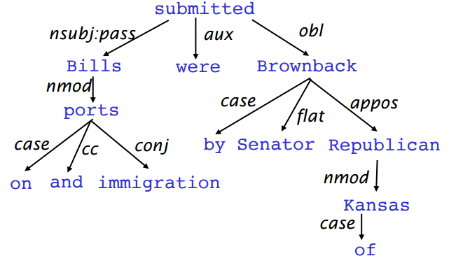

##资料

课程主页： https://web.stanford.edu/class/cs224n /

中文笔记： http://www.hankcs.com/nlp/cs224n-introduction-to-nlp-and-deep-learning.html

视频：https://www.bilibili.com/video/av30326868/?spm_id_from=333

http://www.mooc.ai/course/494

学习笔记：http://www.hankcs.com/nlp/cs224n-introduction-to-nlp-and-deep-learning.html

实验环境推荐使用Linux或者Mac系统，以下环境搭建方法皆适用:

· Docker环境配置： https://github.com/ufoym/deepo
· 本地环境配置： https://github.com/learning511/cs224n-learning-camp/blob/master/environment.md

训练营： https://github.com/learning511/cs224n-learning-camp

**重要的一些资源：**

深度学习斯坦福教程： 

<http://deeplearning.stanford.edu/wiki/index.php/UFLDL%E6%95%99%E7%A8%8B>

廖雪峰python3教程： 

<https://www.liaoxuefeng.com/article/001432619295115c918a094d8954bd493037b03d27bf9a9000>

github教程： 

<https://www.liaoxuefeng.com/wiki/0013739516305929606dd18361248578c67b8067c8c017b000>

莫烦机器学习教程： <http://morvanzhou.github.io/tutorials> /

深度学习经典论文： <https://github.com/floodsung/Deep-Learning-Papers-Reading-Roadmap>

斯坦福cs229代码(机器学习算法python徒手实现)： <https://github.com/nsoojin/coursera-ml-py>

博客： <https://blog.csdn.net/dukuku5038/article/details/82253966>

==数学工具==

**斯坦福资料**：

- 线性代数（链接地址： <http://web.stanford.edu/class/cs224n/readings/cs229-linalg.pdf> ）
- 概率论（链接地址： <http://101.96.10.44/web.stanford.edu/class/cs224n/readings/cs229-prob.pdf> ）
- 凸函数优化（<http://101.96.10.43/web.stanford.edu/class/cs224n/readings/cs229-cvxopt.pdf> ）
- 随机梯度下降算法（链接地址： <http://cs231n.github.io/optimization-1> /）

**中文资料**：

- 机器学习中的数学基本知识（链接地址： <https://www.cnblogs.com/steven-yang/p/6348112.html> ）
- 统计学习方法（链接地址： <http://vdisk.weibo.com/s/vfFpMc1YgPOr> ）
- 大学数学课本（从故纸堆里翻出来^_^）

==编程工具==

**斯坦福资料**：

- Python复习（链接地址： <http://web.stanford.edu/class/cs224n/lectures/python-review.pdf> ）
- TensorFlow教程（链接地址： <https://github.com/open-source-for-science/TensorFlow-Course#why-use-tensorflow> ）

**中文资料**：

- 廖雪峰python3教程（链接地址： 
- <https://www.liaoxuefeng.com/article/001432619295115c918a094d8954bd493037b03d27bf9a9000> ）
- 莫烦TensorFlow教程（链接地址： <https://morvanzhou.github.io/tutorials/machine-learning/tensorflow> /）

##paper

1.A Simple but Tough-to-beat Baseline for Sentence Embeddings

Sanjeev Arora, Yingyu Liang, Tengyu Ma
Princeton University
In submission to ICLR 2017

2.Linear Algebraic Structure of Word Senses, with Applications to Polysemy

Sanjeev Arora, Yuanzhi Li, Yingyu Liang, Tengyu Ma, Andrej Risteski

3.Distributed Representations of Words and Phrases and their ComposiRonality (Mikolov et al. 2013)

4..GloVe: Global Vectors for Word Representation (Pennington et al. (2014)

Word Vector Analogies: SyntacRc and Semantic examples from
http://code.google.com/p/word2vec/source/browse/trunk/questionswords.txt

Word vector distances and their correlation with human judgments
Example dataset: WordSim353
http://www.cs.technion.ac.il/~gabr/resources/data/wordsim353/

5.Improving Word Representations Via Global Context And Multiple Word Prototypes (Huang et al.
2012)

1. Gather fixed size context windows of all occurrences of the word
  (for instance, 5 before and 5 after)
2. Each context is represented by a weighted average of the context
  words’ vectors (using idf-weighting)
3. Apply spherical k-means to cluster these context representations.
4. Finally, each word occurrence is re-labeled to its associated cluster
  and is used to train the word representation for that cluster.

6.Bag of Tricks for Efficient Text Classification
Armand Joulin, Edouard Grave, Piotr Bojanowski, Tomas Mikolov
Facebook AI Research

● fastText is often on par with deep learning classifiers
● fastText takes seconds, instead of days
● Can learn vector representations of words in different languages (with performance better than word2vec!)

## 概述

NLP levels

作为输入一共有两个来源，语音与文本。所以第一级是语音识别和OCR或分词（事实上，跳过分词虽然理所当然地不能做句法分析，但字符级也可以直接做不少应用）。接下来是形态学，援引《统计自然语言处理》中的定义：

> 形态学（morphology）：形态学（又称“词汇形态学”或“词法”）是语言学的一个分支，研究词的内部结构，包括屈折变化和构词法两个部分。由于词具有语音特征、句法特征和语义特征，形态学处于音位学、句法学和语义学的结合部位，所以形态学是每个语言学家都要关注的一门学科［Matthews,2000］。

下面的是句法分析和语义分析，最后面的在中文中似乎翻译做“对话分析”，需要根据上文语境理解下文。

**自然语言处理应用**

一个小子集，从简单到复杂有：

- 拼写检查、关键词检索……
- 文本挖掘（产品价格、日期、时间、地点、人名、公司名）
- 文本分类
- 机器翻译
- 客服系统
- 复杂对话系统

在工业界从搜索到广告投放、自动\辅助翻译、情感舆情分析、语音识别、聊天机器人\管家等等五花八门。

**深度学习是表示学习的一部分，用来学习原始输入的多层特征表示**

## Iteration Based Methods - Word2vec

**Two algorithms**

Skip-grams (SG)
Predict context words given target (position independent)

Continuous Bag of Words (CBOW)
Predict target word from bag-of-words context

**Two (moderately efficient) training methods**

Hierarchical softmax

Negative sampling

**hierarchical softmax tends to be better for infrequent words, while negative sampling**
**works better for frequent words and lower dimensional vectors.**

## Global Vectors for Word Representation (GloVe)

we have looked at two main classes of methods to find word embeddings. 

The first set are count-based and rely on matrix factorization (e.g. LSA, HAL). While these methods effectively leverage global statistical information, they are primarily used to capture word similarities and do poorly on tasks such as word analogy, indicating a sub-optimal vector space structure. 

The other set of methods are shallow window-based (e.g. the skip-gram and the CBOW models), which learn word embeddings by making predictions in local context windows. These models demonstrate the capacity to capture
complex linguistic patterns beyond word similarity, but fail to make use of the global co-occurrence statistics.

Glove：Using global statistics to predict the probability of word j appearing in the context of word i with a least squares objective

1.Co-occurrence Matrix

$X_{ij}$ ：the number of times word j occur in the context of word i

2.Least Squares Objective

$J = \sum_{i=1}^W\sum_{j=1}^W f(X_{ij})(\mu_j^Tv_i - logX_{ij})^2$

In conclusion, the GloVe model efficiently leverages global statistical information by training only on the nonzero elements in a wordword co-occurrence matrix, and produces a vector space with meaningful sub-structure. It consistently outperforms word2vec on the word analogy task, given the same corpus, vocabulary, window size, and training time. It achieves better results faster, and also obtains the best results irrespective of speed.

## Evaluation of Word Vectors

### Intrinsic Evaluation

Intrinsic evaluation of word vectors is the evaluation of a set of word vectors generated by an embedding technique (such as Word2Vec or GloVe) on specific intermediate subtasks (such as analogy completion).

Intrinsic evaluation:
• Evaluation on a specific, intermediate task
• Fast to compute performance
• Helps understand subsystem
• Needs positive correlation with real task to determine usefulness

A popular choice for intrinsic evaluation of word vectors is its performance in completing word vector analogies.

### Extrinsic Evaluation

Extrinsic evaluation of word vectors is the evaluation of a set of word vectors generated by an embedding technique on the real task at hand.

Extrinsic evaluation:
• Is the evaluation on a real task
• Can be slow to compute performance
• Unclear if subsystem is the problem, other subsystems, or internal interactions
• If replacing subsystem improves performance, the change is likely good

Most NLP extrinsic tasks can be formulated as classification tasks.

## About Project

project types:

1. Apply existing neural network model to a new task
2. Implement a complex neural architecture
3. Come up with a new neural network model
4. Theory of deep learning, e.g. optimization

**Apply Existing NNets to Tasks**

1. Define Task:
  • Example: Summarization
2. Define Dataset
   1. Search for academic datasets
     • They already have baselines
     • E.g.: Document Understanding Conference (DUC)
   2. Define your own (harder, need more new baselines)
     • If you’re a graduate student: connect to your research
     • Summarization, Wikipedia: Intro paragraph and rest of large article
     • Be creative: Twitter, Blogs, News

3. Define your metric
  • Search online for well established metrics on this task
  • Summarization: Rouge (Recall-Oriented Understudy for
  Gisting Evaluation) which defines n-gram overlap to human
  summaries
4. Split your dataset!
  • Train/Dev/Test
  • Academic dataset often come pre-split
  • Don’t look at the test split until ~1 week before deadline!
  (or at most once a week)

5. Establish a baseline
  • Implement the simplest model (often logistic regression on
  unigrams and bigrams) first
  • Compute metrics on train AND dev
  • Analyze errors
  • If metrics are amazing and no errors:
  done, problem was too easy, restart :)
6. Implement existing neural net model
  • Compute metric on train and dev
  • Analyze output and errors
  • Minimum bar for this class

7. Always be close to your data!
  • Visualize the dataset
  • Collect summary statistics
  • Look at errors
  • Analyze how different hyperparameters affect performance
8. Try out different model variants
  • Soon you will have more options
  • Word vector averaging model (neural bag of words)
  • Fixed window neural model
  • Recurrent neural network
  • Recursive neural network
  • Convolutional neural network

**A New Model -- Advanced Option**

• Do all other steps first (Start early!)
• Gain intuition of why existing models are flawed
• Talk to researcher/mentor, come to project office hours a lot
• Implement new models and iterate quickly over ideas
• Set up efficient experimental framework
• Build simpler new models first
• Example Summarization:
• Average word vectors per paragraph, then greedy search
• Implement language model (introduced later)
• Stretch goal: Generate summary with seq2seq!

**Project Ideas**
• Summarization
• NER, like PSet 2 but with larger data
Natural Language Processing (almost) from Scratch, Ronan Collobert, Jason Weston, Leon Bottou, Michael
Karlen, Koray Kavukcuoglu, Pavel Kuksa, http://arxiv.org/abs/1103.0398
• Simple question answering, A Neural Network for Factoid Question Answering over
Paragraphs, Mohit Iyyer, Jordan Boyd-Graber, Leonardo Claudino, Richard Socher and Hal Daumé III (EMNLP
2014)
• Image to text mapping or generation,
Grounded Compositional Semantics for Finding and Describing Images with Sentences, Richard Socher, Andrej
Karpathy, Quoc V. Le, Christopher D. Manning, Andrew Y. Ng. (TACL 2014)
or
Deep Visual-Semantic Alignments for Generating Image Descriptions, Andrej Karpathy, Li Fei-Fei
• Entity level sentiment
• Use DL to solve an NLP challenge on kaggle,
Develop a scoring algorithm for student-written short-answer responses, https://www.kaggle.com/c/asap-sas

**Another example project: Sentiment**
• Sentiment on movie reviews: http://nlp.stanford.edu/sentiment/
• Lots of deep learning baselines and methods have been tried

**And here are some NLP datasets:**

- [Kaggle Datasets](https://www.kaggle.com/datasets)
- Sequence Tagging: [Named Entity Recognition](https://www.clips.uantwerpen.be/conll2003/ner/) and [Chunking](https://www.clips.uantwerpen.be/conll2000/chunking/)
- [Dependency Parsing](https://github.com/UniversalDependencies/UD_English)
- [Quora Question Pairs](https://www.kaggle.com/c/quora-question-pairs)
- [Sentence-Level Sentiment Analysis](https://nlp.stanford.edu/sentiment/treebank.html) and [Document-Level Sentiment Analysis](http://ai.stanford.edu/~amaas/data/sentiment/)
- [Textual Entailment](https://nlp.stanford.edu/projects/snli/)
- [Machine Translation (Ambitious)](https://wit3.fbk.eu/mt.php?release=2016-01)
- [Yelp Reviews](https://www.yelp.com/dataset/challenge)
- [WikiText Language Modeling](https://www.salesforce.com/products/einstein/ai-research/the-wikitext-dependency-language-modeling-dataset/)
- [Fake News Challenge](https://github.com/FakeNewsChallenge/fnc-1)
- [Toxic Comment Classification](https://www.kaggle.com/c/jigsaw-toxic-comment-classification-challenge)

https://web.stanford.edu/class/cs224n/project.html

## Dependency Parsing

### Dependency Grammar and Dependency Structure

Parse trees in NLP, analogous to those in compilers, are used to analyze the syntactic structure of sentences.

There are two main types of structures used - constituency structures and dependency structures.

Constituency Grammar uses phrase structure grammar to organize words into nested constituents.

Dependency structure of sentences shows which words depend on (modify or are arguments of) which other words.

Figure 1: Dependency tree for the sentence "Bills on ports and immigration were submitted by Senator Brownback,
Republican of Kansas"

**1.1 Dependency Parsing**

Dependency parsing is the task of analyzing the syntactic dependency structure of a given input sentence S. The output of a dependency parser is a dependency tree where the words of the input sentence are connected by typed dependency relations.

there are two subproblems in dependency parsing：

1. Learning: Given a training set D of sentences annotated with dependency graphs, induce a parsing model M that can be used to parse new sentences.
2. Parsing: Given a parsing model M and a sentence S, derive the optimal dependency graph D for S according to M.

**1.2 Transition-Based Dependency Parsing**

Transition-based dependency parsing relies on a state machine which defines the possible transitions to create the mapping from the input sentence to the dependency tree.

**1.3 Greedy Deterministic Transition-Based Parsing**

**1.4 Neural Dependency Parsing**

