#Foundations of Convolutional Neural Networks 

##计算机视觉

Computer Vision Problems:

Image Classification

Object detection

Neural Style Transfer

## 边缘检测示例

Vertical edge detection

## 更多边缘检测内容

通过å·ç§¯æ“作å¯ä»¥æ‰¾å‡ºæ°´å¹³æˆ–垂直边缘(比如æ æ†)

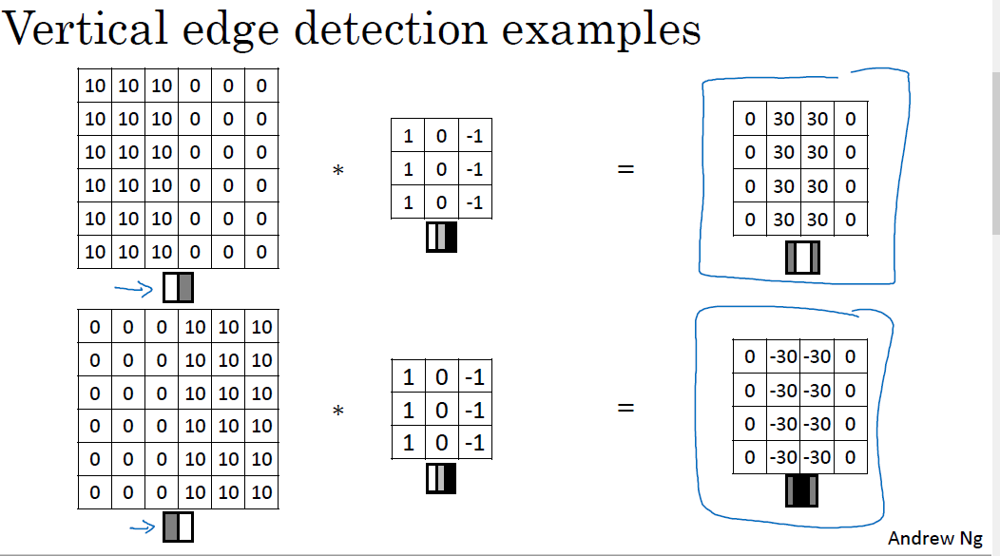

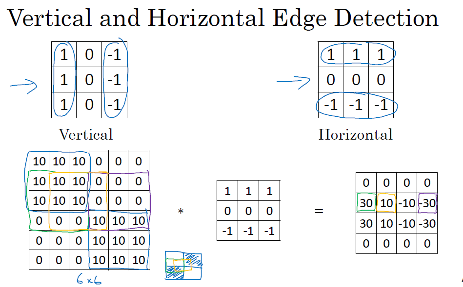

Sober filter
$$
\begin{matrix}
        1 & 0 & -1 \\
        2 & 0 & -2 \\
        1 & 0 & -1 \\
        \end{matrix}
$$
Scharr filter
$$
\begin{matrix}
          3 & 0 & -3 \\
        10 & 0 & -10 \\
          3 & 0 & -3 \\
        \end{matrix}
$$
或者使用神ç»ç½‘络åå‘传播学习filter

## Padding

å·ç§¯åŽçš„维度是(n-f+1)×(n-f+1)

缺点：

1.æ¯æ¬¡åšå·ç§¯æ“作时，图åƒéƒ½ä¼šç¼©å°

2.角è½è¾¹çš„åƒç´ ç‚¹è¾“出较少，丢掉了很多边缘信æ¯

四周填充padding, 填充层数为p输出维度å˜æˆ(n+2p-f+1)×(n+2p-f+1)

Valid convolutions：n×n  * f×f  ——> (n-f+1)×(n-f+1)

Same convolutions：Pad so that output size is the same as the input size

(n+2p-f+1)×(n+2p-f+1)，令n+2p-f+1=n, p=(f-1)/2

计算机视觉里f一般是奇数，因为

1.如果f是å¶æ•°ï¼Œåªèƒ½è¿›è¡Œä¸å¯¹ç§°çš„å¡«å……

2.奇数维filter有一个中心点，便于指出过滤器的ä½ç½®

## å·ç§¯æ­¥é•¿

n×n image    f×f filter

padding p       stride s

输出为$\lfloor (n+2p-f)/s+1\rfloor × \lfloor (n+2p-f)/s+1\rfloor$

cross-correlation vs. convolution

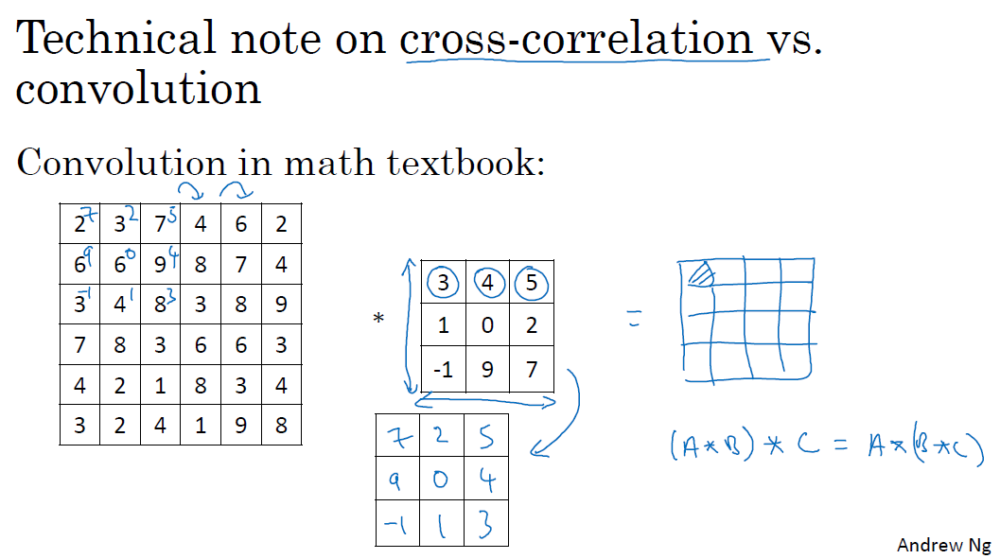

## å·ç§¯ä¸ºä½•æœ‰æ•ˆ

åªæ£€æµ‹çº¢è‰²çš„垂直边缘

检测所有颜色的垂直边缘

多个过滤器

- **在处ç†å›¾åƒæ—¶ï¼Œä¸ºä»€ä¹ˆä½¿ç”¨å·ç§¯è€Œä¸ä»…仅是 FC 层？** 这个问题éžå¸¸æœ‰è¶£ï¼Œå› ä¸ºå…¬å¸é€šå¸¸ä¸ä¼šé—®è¿™æ ·çš„问题。正如你所料，一家专注于计算机视觉的公å¸é—®äº†è¿™ä¸ªé—®é¢˜ã€‚这个问题的答案由两部分组æˆã€‚首先，å·ç§¯ä¿ç•™ã€ç¼–ç å¹¶å®žé™…使用图åƒçš„空间信æ¯ã€‚如果我们åªä½¿ç”¨ FC 层，就没有相关的空间信æ¯ã€‚其次，å·ç§¯ç¥žç»ç½‘络（CNN）æ供了部分内置的平移方差，因为æ¯ä¸ªå·ç§¯æ ¸éƒ½ç›¸å½“于自己的过滤器和特å¾æ£€æµ‹å™¨ã€‚
- **是什么让 CNN 具备平移ä¸å˜æ€§ï¼Ÿ** 如上所述，æ¯ä¸ªå·ç§¯æ ¸éƒ½æ˜¯è‡ªå·±çš„过滤器和特å¾æ£€æµ‹å™¨ã€‚因此，å‡è®¾ä½ æ­£åœ¨è¿›è¡Œå¯¹è±¡æ£€æµ‹ï¼Œå¯¹è±¡åœ¨å›¾åƒä¸­çš„ä½ç½®å¹¶ä¸é‡è¦ï¼Œå› ä¸ºæˆ‘们将以滑动窗å£çš„æ–¹å¼åœ¨æ•´ä¸ªå›¾åƒä¸Šåº”用å·ç§¯ã€‚
- **为什么分段 CNN 通常具有编ç å™¨å’Œè§£ç å™¨ç»“构？** ç¼–ç å™¨ CNN 基本上å¯ä»¥è¢«è®¤ä¸ºæ˜¯ç‰¹å¾æå–网络，而解ç å™¨ä½¿ç”¨è¿™äº›ä¿¡æ¯æ¥é¢„测图åƒç‰‡æ®µï¼ˆé€šè¿‡â€œè§£ç â€ç‰¹å¾å¹¶æ”¾å¤§åˆ°åŽŸå§‹å›¾åƒå¤§å°ï¼‰ã€‚

## å•å±‚å·ç§¯ç½‘络

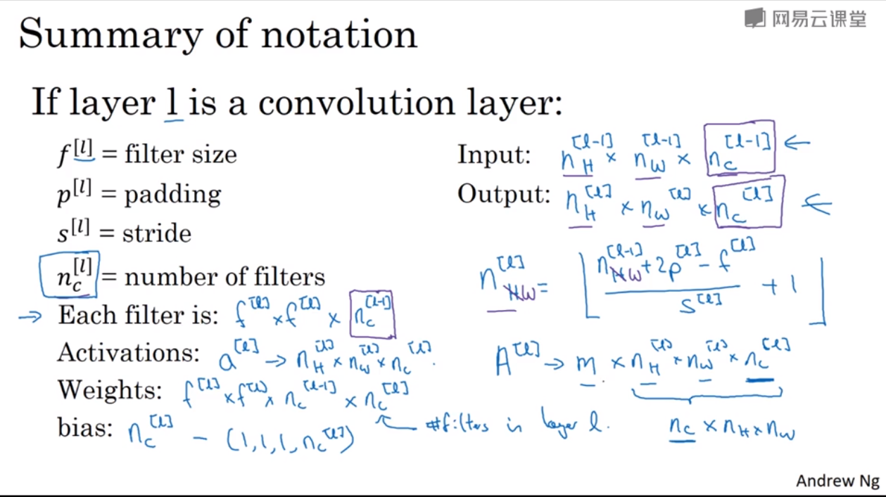

## 简å•å·ç§¯ç½‘络示例

channel(depth)越æ¥è¶Šå¤§ï¼ŒWidthå’ŒHeight越æ¥è¶Šå°

Types of layer in a convolutional network

Convolution

Pooling

Fully connected

## 池化层

Max pooling, Average pooling

Hyperparameters:

f：filter size

s：stride

$n_H×n_W×n_C——>\lfloor \frac{n_H-f}s+1\rfloor × \lfloor \frac{n_W-f}s+1\rfloor×n_H$

No parameters to learnï¼

- **为什么我们在分类 CNN 中有最大池化（max-pooling）？** 这也是我在é¢è¯•ä¸€ä¸ªè®¡ç®—机视觉相关èŒä½æ˜¯è¢«é—®åˆ°çš„一个问题。CNN 中的最大池化å¯ä»¥å‡å°‘计算，因为在池化åŽï¼Œç‰¹å¾å›¾å˜å¾—æ›´å°äº†ã€‚因为你正在进行最大程度的激活，所以ä¸ä¼šä¸¢å¤±å¤ªå¤šçš„语义信æ¯ã€‚还有一ç§ç†è®ºè®¤ä¸ºï¼Œæœ€å¤§æ± åŒ–有助于为 CNN æ供更多的方差平移。

## å·ç§¯ç¥žç»ç½‘络示例

## 为什么使用å·ç§¯

å‚数共享和稀ç–连接

Parameter sharing: A feature detector (such as a vertical edge detector) that's useful in one part of the image is probably useful in another part of the image.

Sparsity of connections: In each layer, each output value depends only on a small number of inputs.

Use gradient descent to optimize parameters to reduce $J$

# Deep convolutional models: case studies 

## Case studies

### 为什么è¦è¿›è¡Œå®žä¾‹æŽ¢ç©¶

### ç»å…¸ç½‘络

**LeNet-5**

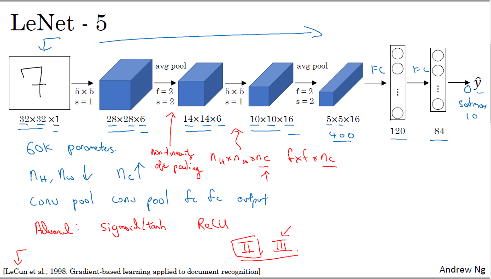

**AlexNet**

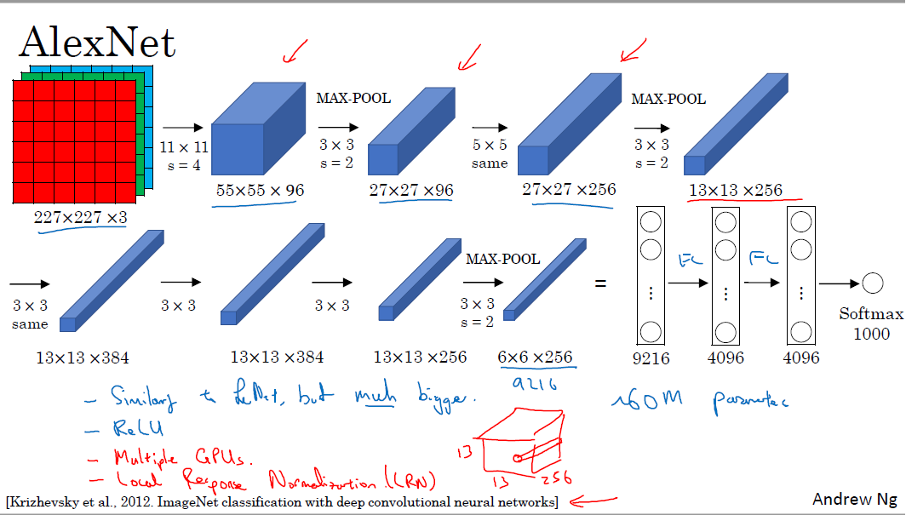

**VGG-16**

### 残差网络

Residual Nerworks(ResNets)

Residual block

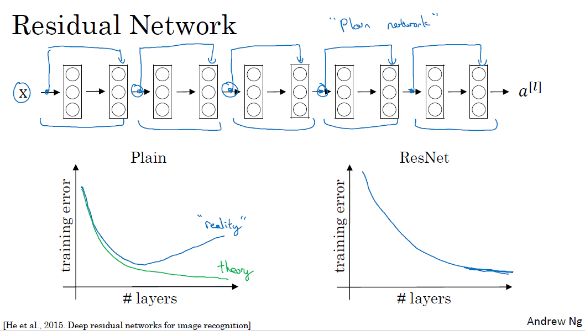

### 残差网络为什么有用

- **残差网络有什么æ„义？** 残差连接的主è¦ä½œç”¨æ˜¯å…许从å‰å±‚直接访问特å¾ï¼Œè¿™è®©ä¿¡æ¯åœ¨æ•´ä¸ªç½‘络中传播å˜å¾—更加容易。

残差å—学习æ’等函数éžå¸¸å®¹æ˜“，效率并ä¸æ¯”一般网络低

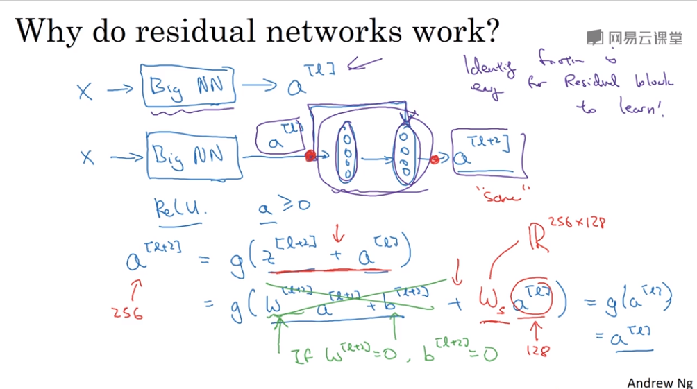

### 网络中的网络以åŠ1×1å·ç§¯

- **为什么è¦ä½¿ç”¨å¾ˆå¤šå°çš„å·ç§¯æ ¸ï¼Œæ¯”如 3x3，而ä¸æ˜¯æ›´å¤§çš„å·ç§¯æ ¸ï¼Ÿ**VGGNet 论文（https://arxiv.org/pdf/1409.1556.pdf） 对此åšäº†å¾ˆå¥½çš„解释。有两个原因：首先，你å¯ä»¥ä½¿ç”¨å‡ ä¸ªè¾ƒå°çš„å·ç§¯æ ¸æ¥èŽ·å–相åŒçš„感知字段并æ•èŽ·æ›´å¤šçš„空间上下文，使用较å°çš„å·ç§¯æ ¸æ„味ç€è¾ƒå°‘çš„å‚数和计算。其次，因为对于较å°çš„å·ç§¯æ ¸ï¼Œä½ éœ€è¦ä½¿ç”¨æ›´å¤šçš„过滤器，这样就能够使用更多的激活函数，你的 CNN å°±å¯ä»¥å­¦ä¹ æ›´å…·è¾¨åˆ«åŠ›çš„映射函数。

### 谷歌Inception网络

ä¸éœ€è¦äººå·¥é€‰æ‹©è¿‡æ»¤å™¨ç»´åº¦ï¼ŒæŠŠæ‰€æœ‰å¯èƒ½æ‰”给他，自己训练

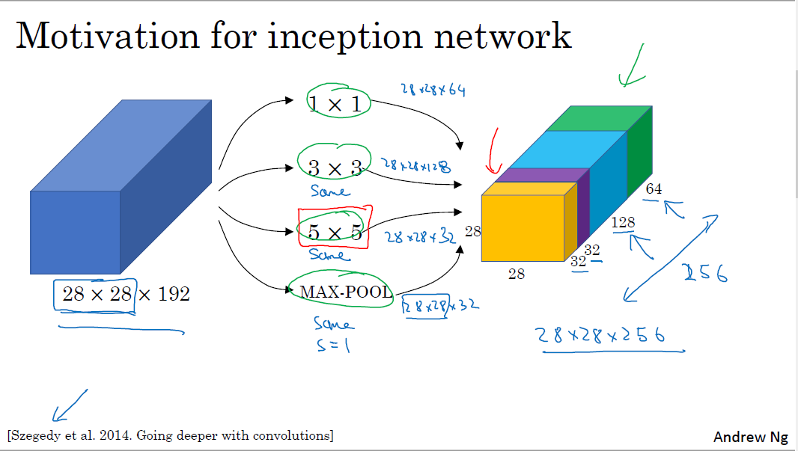

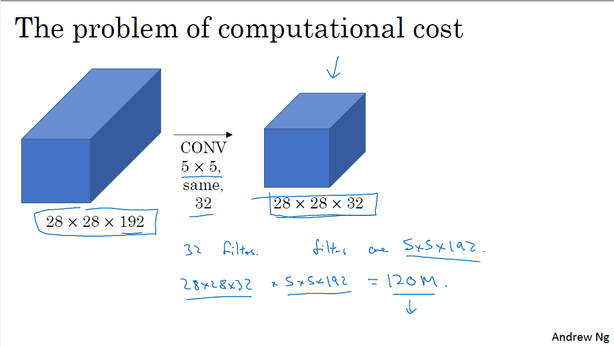

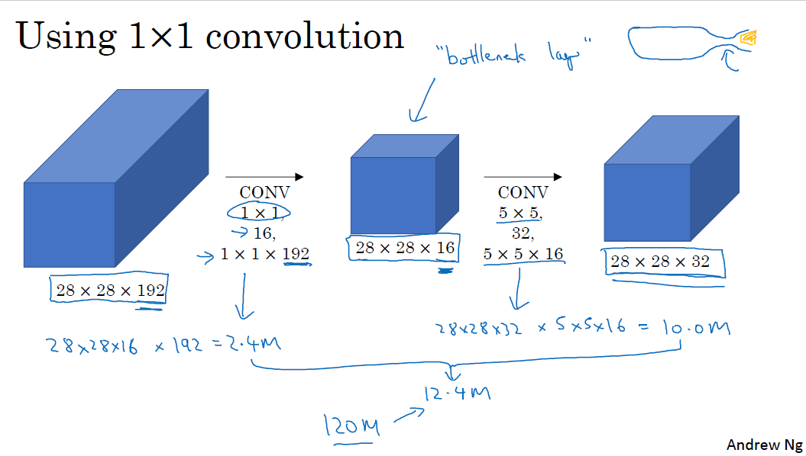

### Inception网络

å³GoogleNet

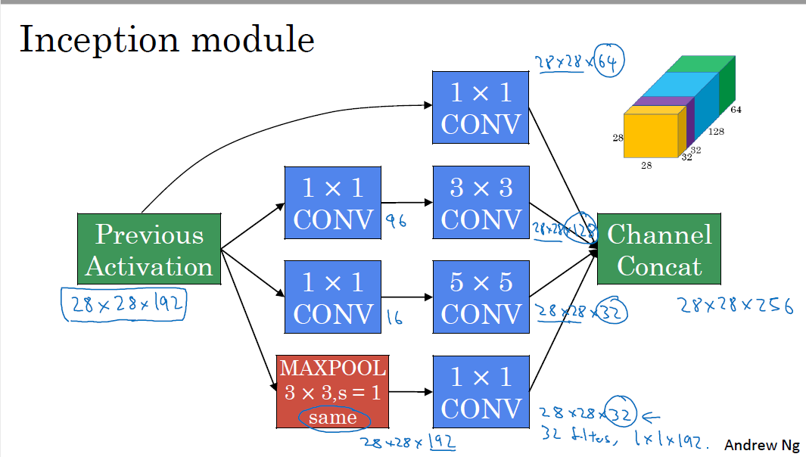

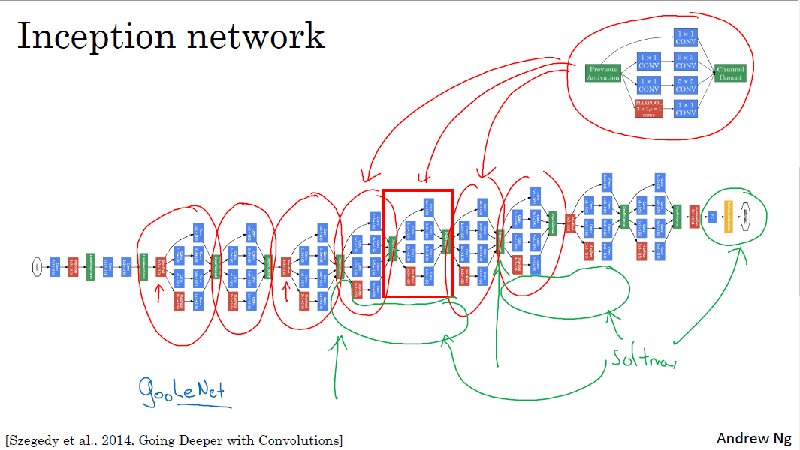

## Practical advices for using ConvNets

### 使用开æºçš„实现方案

Github

### è¿ç§»å­¦ä¹ 

æ•°æ®ä¸å¤Ÿï¼Œä½¿ç”¨ç±»ä¼¼çš„神ç»ç½‘络的代ç å’Œæƒé‡ï¼Œåˆ›é€ è‡ªå·±çš„输出层，训练输出层æƒé‡

这时å¯ä»¥æå‰è®¡ç®—好输出层之å‰çš„激活函数的输出，存到硬盘。这样之åŽå†è®­ç»ƒå°±å¯ä»¥å‡å°‘计算æˆæœ¬

也å¯ä»¥é‡æ–°è®­ç»ƒå¤šå±‚çš„æƒé‡ï¼Œæ•°æ®é‡å¤Ÿçš„情况下。

如果数æ®è¶³å¤Ÿå¤šï¼Œè®­ç»ƒæ‰€æœ‰çš„æƒé‡ï¼Œå°†ä¸‹è½½çš„æƒé‡ä½œä¸ºåˆå§‹åŒ–æƒé‡

### æ•°æ®æ‰©å……

Mirroringé•œåƒ, Random Croppingéšæœºè£å‰ª, Rotation旋转, Shearing剪切, Local warping局部弯曲

Color shifting颜色å˜æ¢

Advanced:   PCA, AlexNet paper "PCA color augumentation"

### 计算机视觉现状

Two sources of knowledge

- Labeled data
- Hand engineered features/network architecture/other components

æ•°æ®é‡å°‘，更多的还是用手工特å¾å·¥ç¨‹

Tips for doing well on benchmarks/winning competitions

Ensembling

- Train several networks independently and average their outputs

Multi-crop at test time

- Run classifier on multiple versions of test images and average results
- 10-crop：对图åƒåŠé•œåƒå–中间的ã€å››ä¸ªè§’的图进行训练

Use open source code

- Use architectures of networks published in the literature
- Use open source implementations if possible
- Use pretrained models and fine-tune on your dataset

#Object detection algorithms

## 目标定ä½

ä¸ä»…è¦åˆ¤æ–­å›¾ç‰‡ç‰©ä½“是什么，还è¦åˆ¤æ–­å…¶å…·ä½“ä½ç½®

除了物体类别，还è¦è®©ç¥žç»ç½‘络输出物体的边框的四个数字，(bx, by, bh, bw)物体的中心点ä½ç½®ï¼Œé«˜åº¦ï¼Œå®½åº¦

## 特å¾ç‚¹æ£€æµ‹

landmark detection

输出æ¯ä¸ªç‰¹å¾ç‚¹çš„å标，比如人脸识别中的眼ç›ã€å˜´å·´ã€å¾®ç¬‘等脸部特å¾

人体姿æ€æ£€æµ‹ï¼Œè®¾å®šå…³é”®ç‰¹å¾ç‚¹ï¼Œæ ‡æ³¨ï¼Œè®­ç»ƒï¼Œç¡®å®šäººç‰©å§¿æ€åŠ¨ä½œ

## 目标检测

Sliding windows detection滑动窗å£ç›®æ ‡æ£€æµ‹æ–¹æ³•

以固定幅度滑动窗å£ï¼Œé历图åƒçš„æ¯ä¸ªåŒºåŸŸï¼ŒæŠŠè¿™äº›å‰ªåˆ‡åŽçš„å°å›¾åƒè¾“å…¥å·ç§¯ç½‘络，然åŽè¿›è¡Œåˆ†ç±»

é‡å¤å¤šæ¬¡ï¼Œæ‰©å¤§çª—å£å¤§å°

步幅å°â€”—æˆæœ¬é«˜ï¼Œæ­¥å¹…大——性能低

## å·ç§¯çš„滑动窗å£å®žçŽ°

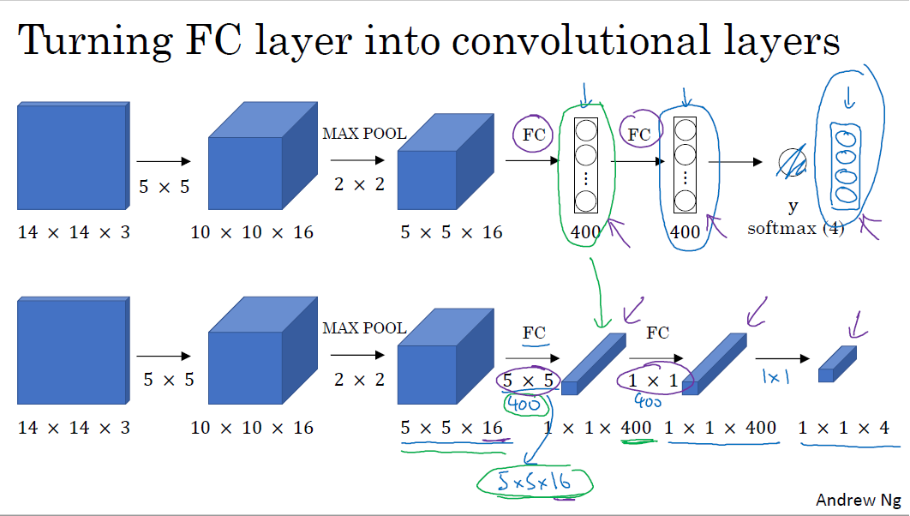

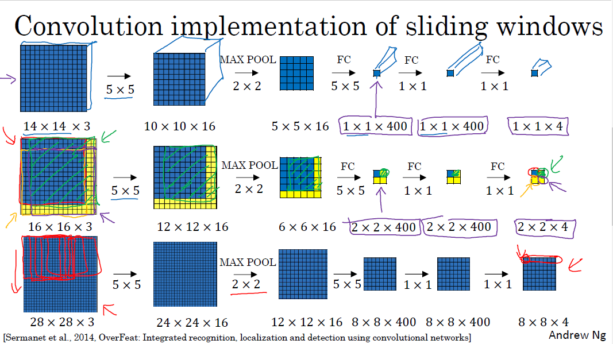

## Bounding Box预测

YOLO algorithm

将图åƒåˆ†æˆå¾ˆå¤šä¸ªæ ¼å­ï¼Œå¯¹æ¯ä¸ªæ ¼å­ï¼Œéƒ½æœ‰ä¸€ä¸ªæ ‡ç­¾y，就是上é¢ç›®æ ‡å®šä½ä¸­çš„y

ä¸æ˜¯å¯¹æ¯ä¸ªæ ¼å­åˆ†åˆ«è¿è¡Œç®—法，而是利用å·ç§¯ä¸€æ¬¡å®žçŽ°ï¼Œæ‰€ä»¥è¿è¡Œé€Ÿåº¦å¾ˆå¿«ï¼Œç»å¸¸ç”¨äºŽå®žæ—¶æ£€æµ‹

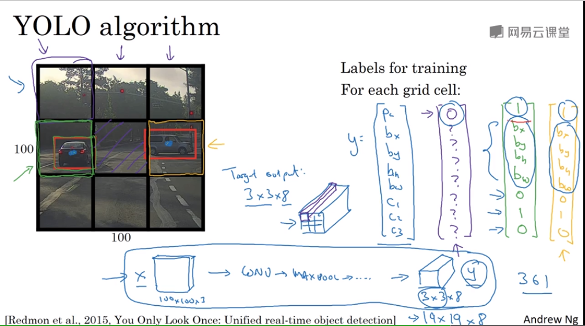

## 交并比

Intersection over union(IoU)

= size of intersection/size of union

其中intersection和union是预测边框与真实边框的交集和并集

Correct if IoU>=0.5

## éžæžå¤§å€¼æŠ‘制

non-max suppression

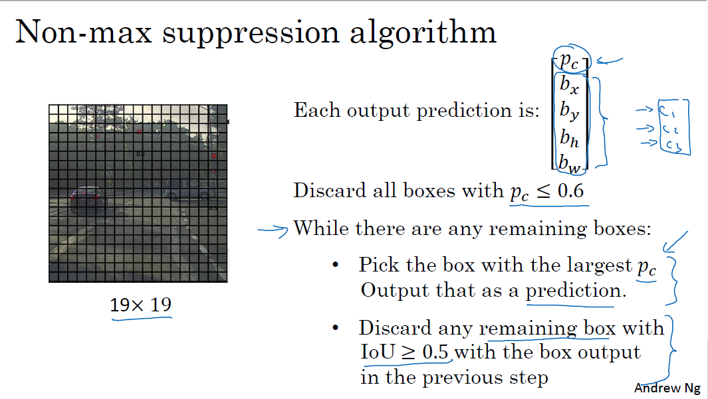

## Anchor Boxes

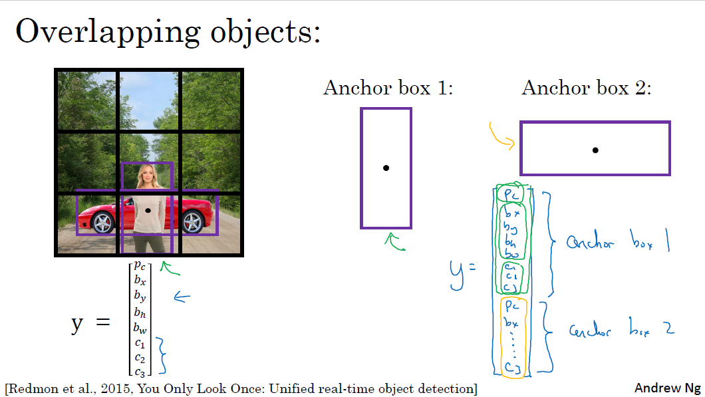

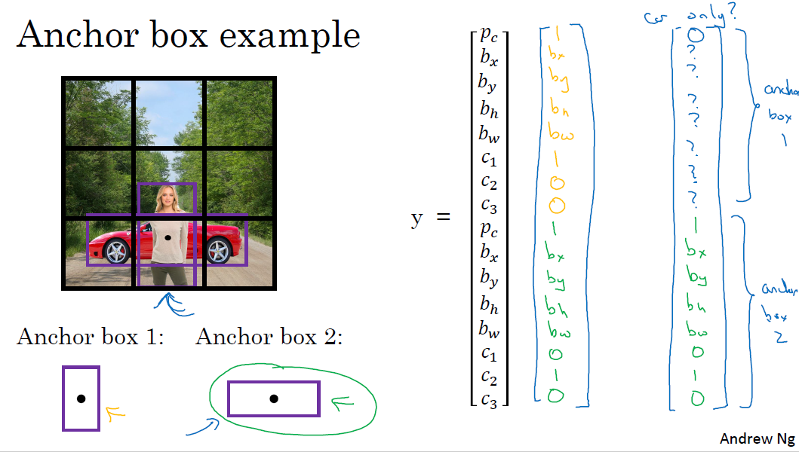

## YOLO算法

putting it together: YOLO algorithm

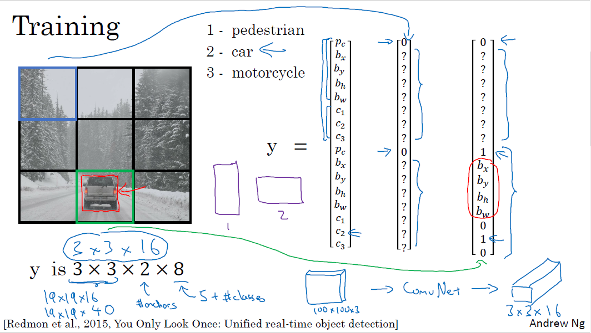

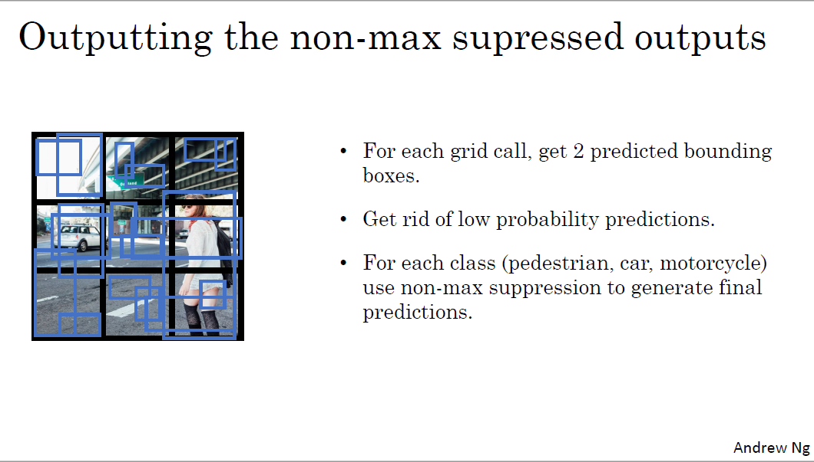

## RPN网络

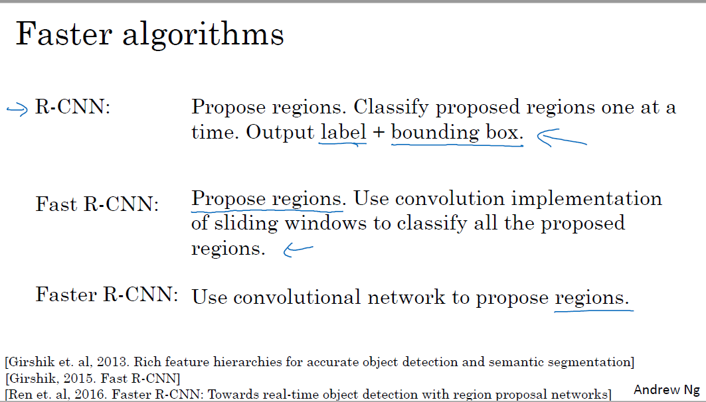

## 目标检测算法实践(补充)

å‚考https://mp.weixin.qq.com/s/2mIuy4t3QUdSo0xaBuJRXA

https://medium.com/@jonathan_hui/what-do-we-learn-from-region-based-object-detectors-faster-r-cnn-r-fcn-fpn-7e354377a7c9

# Special applications: Face recognition & Neural style transfer 

## Face Recognition

### 什么是人脸识别

Face verification vs. face recognition

Verification

- Input image, name/ID
- Output whether the input image is that of the claimed person

Recognition

- Has a database of K persons
- Get an input image
- Output ID if the image is any of the K persons (or “not recognizedâ€)

### One-shot learning

æ ¹æ®ä¸€å¼ ç…§ç‰‡å­¦ä¹ 

Learning from one example to recognize the person again

Learning a "similarity" function

d(img1, img2) = degree of difference between images

If d(img1, img2) ≤ τ， "same"     else  "different"

### Siamese网络

用åŒæ ·çš„å·ç§¯ç¥žç»ç½‘络架构和å‚数，两个img作为输入，得到两个imgçš„encoding，比较两个encodingçš„è·ç¦»

Goal of learning

Parameters of NN define an encoding $f(x^{(i)})$

Learn parameters so that:

​	If $x^{(i)}, x^{(j)}$ are the same person, $||f(x^{(i)})-f(x^{(j)})||^2$ is small.

​	If $x^{(i)}, x^{(j)}$ are the different person, $||f(x^{(i)})-f(x^{(j)})||^2$ is large.

[Taigman et. al., 2014. DeepFace closing the gap to human level performance]

### Triplet æŸå¤±

为了阻止学习到的所有编ç éƒ½æ˜¯ä¸€æ ·çš„，è¦åŠ ä¸€ä¸ªmargin，并且拉大了正负样本两者之间的è·ç¦»

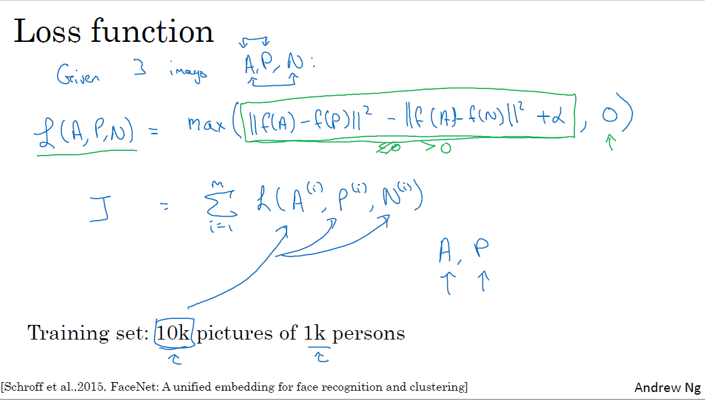

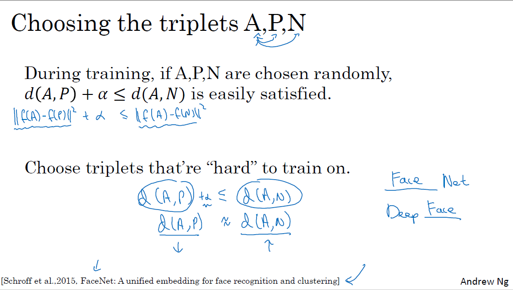

因为è¦æ±‚的训练集很大，æˆæœ¬è¾ƒé«˜ï¼Œæ‰€ä»¥ä¸å¿…从头开始，å¯ä»¥ä¸‹è½½åˆ«äººçš„预训练模型

论文：A unified embedding for face recognition and clustering

### é¢éƒ¨éªŒè¯ä¸ŽäºŒåˆ†ç±»

最åŽä¸€å±‚进行二分类，åŒä¸€ä¸ªäººè¾“出1，å¦åˆ™è¾“出0

##Neural Style Transfer

### 什么是神ç»é£Žæ ¼è¿ç§»

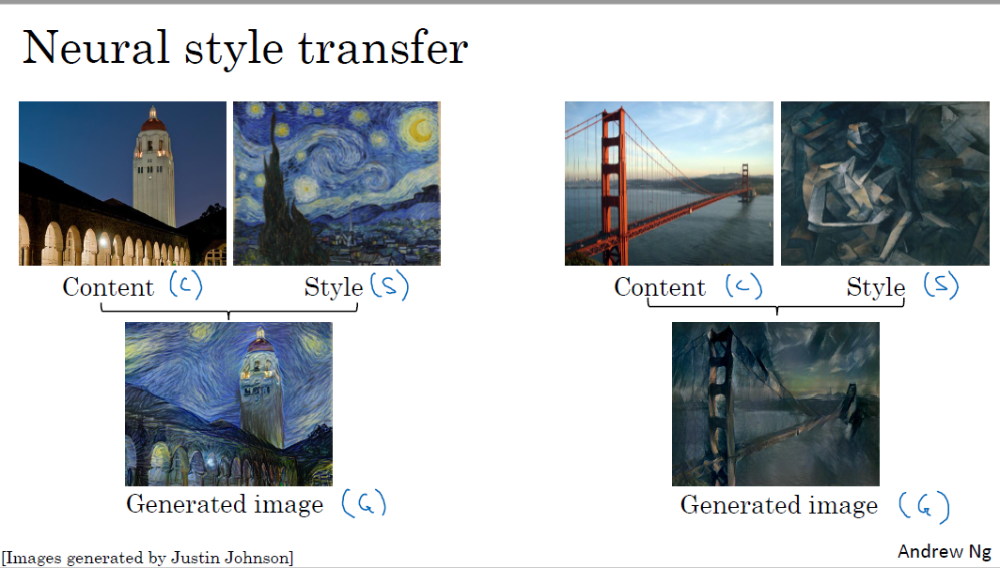

###深度å·ç§¯ç½‘络在学什么

é åŽçš„éšè—å•å…ƒä¼šçœ‹åˆ°æ›´å¤§çš„图片å—

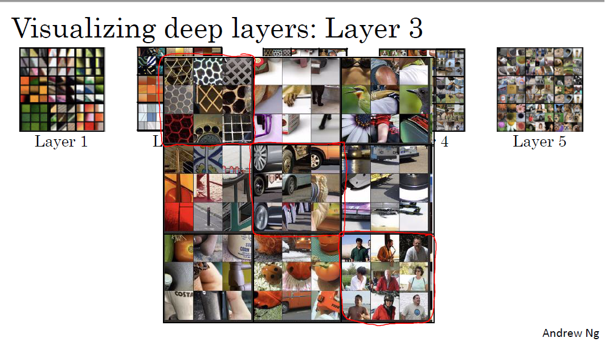

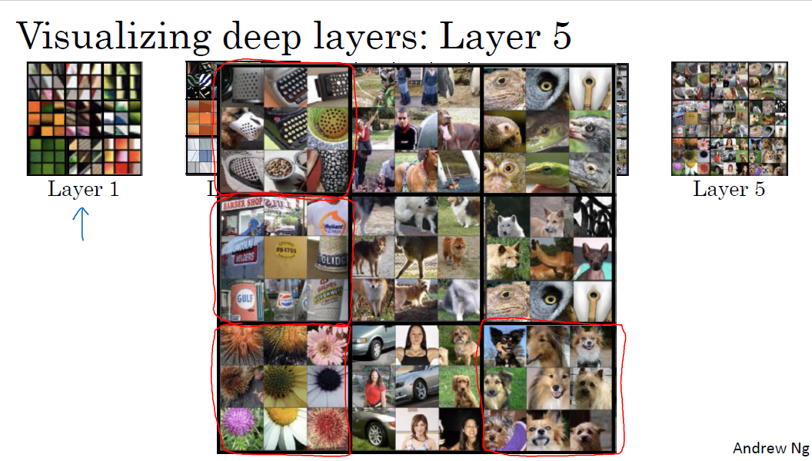

[Zeiler and Fergus., 2013, Visualizing understanding convolutional networks]

### 代价函数

### 内容代价函数

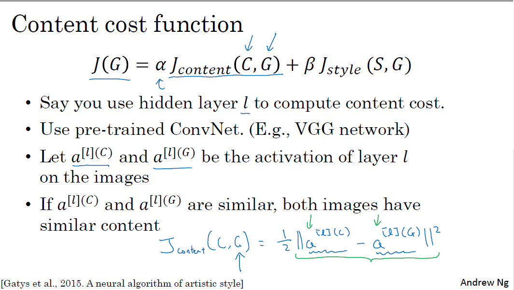

### 风格æŸå¤±å‡½æ•°

Say you are using layer ð‘™â€™s activation to measure “style.â€
Define style as correlation between activations across channels.

How correlated are the activations across different channels?

相关系数æ述了这些ä¸åŒç‰¹å¾åŒæ—¶å‡ºçŽ°çš„概率

### 一维到三维å·ç§¯æŽ¨å¹¿

14×1   *  5×1 ——> 10×16 (16 filters)   * 5×16——>  6×32  (32filters)

14×14×14×1   * 5×5×5×1  ——>10×10×10×16 （16 filters)   *  5×5×5×16 ——> 6×6×6×32   (32filters)

