# 深度学习

英文版深度学习：<http://www.deeplearningbook.org/> 

中文翻译版深度学习：<https://github.com/exacity/deeplearningbook-chinese>

参考资料：https://github.com/InveterateLearner/Deep-Learning-Book-Chapter-Summaries

https://medium.com/inveterate-learner

## 第1部分 应用数学与机器学习基础

## 第2章 线性代数

### 2.1 标量、向量、矩阵和张量

**标量**(scalar)：一个单独的数，用斜体表示，通常被赋予小写的变量名称。

**向量**(vector)：一列数，粗体的小写变量名称，比如$x$.

**矩阵**(matrix)：一个二维数组，粗体的大写变量名称，比如$A$.

**张量**(tensor)：一个数组中的元素分布在若干维坐标的规则网格中，

允许矩阵和向量相加，产生一个新的矩阵：

$C = A + b$ ，其中 $C_{i, j} = A_{i, j} + b_{j}$，即向量$b$和矩阵$A$的每一行相加。

这种隐式地复制向量$b$到很多位置的方式，称为**广播**(broadcasting)。

两个广播的例子：

```python
import numpy as np
M = np.arange(9).reshape(3, 3)
C = np.arange(3).reshape(3, 1)
print("M:")
print(M)
print("C:")
print(C)
print("M+C:")
print(M+C)
```

```
M:
[[0 1 2]
 [3 4 5]
 [6 7 8]]
C:
[[0]
 [1]
 [2]]
M+C:
[[ 0  1  2]
 [ 4  5  6]
 [ 8  9 10]]
```

```python
import numpy as np
M = np.arange(9).reshape(3, 3)
C = np.arange(3).reshape(1, 3)
print("M:")
print(M)
print("C:")
print(C)
print("M+C:")
print(M+C)
```

```
M:
[[0 1 2]
 [3 4 5]
 [6 7 8]]
C:
[[0 1 2]]
M+C:
[[ 0  2  4]
 [ 3  5  7]
 [ 6  8 10]]
```

### 2.2 矩阵和向量相乘

两个矩阵$A_{mn}$ 和 $B_{kp}$ 的**矩阵乘积**(matrix product)是$C$, 为了使乘法可被定义，必须满足 $n = k$.  $C (= AB)$ 的形状是 $m$ x $p$. 

**元素对应乘积**(element-wise product)或**Hadamard乘积**(Hadamard product)是两个矩阵对应元素的乘积，记为 $A \odot B$ . 

两个相同维数的向量$x$ 和 $y$ 的**点积**(dot-product) 可看作矩阵乘积$x^Ty$.

有用的性质:

1. $A(B+C) = AB + AC$ (分配律)
2. $A(BC) = (AB)C$    (结合律)
3. $AB \ne BA$ (一般情况下不满足交换律)
4. $(AB)^T = B^TA^T$
5. $x^Ty = (x^Ty)^T = y^Tx$

线性方程组:

$  Ax = B \tag{2.11} $

其中 $A \in ℝ^{mxn}$ 和 $b \in ℝ^{m}$ 都是已知的，$x \in ℝ^{n}$是要求解的未知向量。上式可以写成$m$个线性方程，其中 第 $i$ 个方程是：

$A_{i,1}x_1 + A_{i,2}x_2 + ... + A_{i,n}x_n = b_i$

### 2.3 单位矩阵和逆矩阵

**单位矩阵**(identity matrix)，任意向量和单位矩阵相乘，都不会改变。我们将保持n维向量不变的单位矩阵记作$I_n \in R^{n\times n}$，单位矩阵的所有沿主对角线的元素都是1，而其他位置的所有元素都是0.

矩阵$A$的逆矩阵记作$A^{-1}$，其定义的矩阵满足如下条件：

$A^{-1}A=I_n$

可以用以下步骤求解方程组：

$$
Ax = b \\
A^{-1}Ax = A^{-1}b \\
I_nx = A^{-1}b \\
x = A^{-1}b
$$
如果逆矩阵存在，那么上式肯定对于每一个向量$b$恰好存在一个解。

### 2.4 线性相关和生成子空间

对于方程组而言，对于向量$b$的某些值，有可能不存在解，或者存在无限多个解。存在多于一个解但是少于无限多个解的情况是不可能发生的。因为如果$x$和$y$都是某方程组的解，则$z=\alpha x+(1-\alpha)y$也是该方程组的解。

为了分析方程有多少个解，我们可以将A 的列向量看作从原点（origin）（元素都是零的向量）出发的不同方向，确定有多少种方法可以到达向量b。在这个观点下，向量$x$ 中的每个元素表示我们应该沿着这些方向走多远，即$x_i $表示我们需要沿着第$i $个向量的方向走多远：

$$ Ax = \sum_{i=1}^{n} x_iA_{:, i}  $$

一般而言，这种操作被称为**线性组合**（linear combination）。形式上，一组向量的线
性组合，是指每个向量乘以对应标量系数之后的和，即：

$\sum_{i=1}^{n} c_iv^{(i)}$

一组向量的**生成子空间**（span）是原始向量线性组合后所能抵达的点的集合。

确定$Ax = b$ 是否有解相当于确定向量$b$ 是否在$A$ 列向量的生成子空间中。这个特殊的生成子空间被称为$A $的**列空间**（column space）或者$A $的**值域**（range）。

为了使方程$Ax = b$ 对于任意向量$b \in R^m$ 都存在解，我们要求$A$ 的列空间构成整个$R^m$。如果$R^m$中的某个点不在$A$ 的列空间中，那么该点对应的$b$ 会使得该方程没有解。矩阵A 的列空间是整个$R^m$ 的要求，意味着$A$ 至少有m 列，即n ≥ m。否则，$A$ 列空间的维数会小于m。例如，假设A 是一个3 x 2 的矩阵。目标$b$ 是3 维的，但是$x$ 只有2 维。所以无论如何修改$x$ 的值，也只能描绘出$R^3$空间中的二维平面。当且仅当向量$b$ 在该二维平面中时，该方程有解。

不等式n ≥  m 仅是方程对每一点都有解的必要条件。这不是一个充分条件，因为有些列向量可能是冗余的。

正式地说，这种冗余被称为**线性相关**（linear dependence）。如果一组向量中的任意一个向量都不能表示成其他向量的线性组合，那么这组向量称为**线性无关**（linearly independent）.

如果一个矩阵的列空间涵盖整个$R^m$，那么该矩阵必须包含至少一组m 个线性无关的向量。
这是式(2.11) 对于每一个向量b 的取值都有解的充分必要条件。值得注意的是，这个条件是说该向量集恰好有m 个线性无关的列向量，而不是至少m 个。

要想使矩阵可逆，我们还需要保证式(2.11) 对于每一个b 值至多有一个解。为此，我们需要确保该矩阵至多有m 个列向量。否则，该方程会有不止一个解。综上所述，这意味着该矩阵必须是一个**方阵**（square），即m = n，并且所有列向量都是线性无关的。一个列向量线性相关的方阵被称为**奇异的**（singular）。如果矩阵A 不是一个方阵或者是一个奇异的方阵，该方程仍然可能有解。但是我们不能使用矩阵逆去求解。

对于方阵而言，它的左逆和右逆是相等的。

### 2.5 范数

有时我们需要衡量一个向量的大小。在机器学习中，我们经常使用被称为**范数**（norm）的函数衡量向量大小。形式上，$L^p $范数定义如下

$$ ||\mathbf{x}||_p = (\sum_{i} |x_i|^p)^{\frac{1}{p}} $$

其中$p \in R, p ≥ 1$。

范数是将向量映射到非负值的函数。直观上来说，向量$x $的范数衡量从原点到点$x$ 的距离。更严格地说，范数是满足下列性质的任意函数：

- $f(x) = 0 \Rightarrow x = 0$
- $f(x+y) \leq f(x) + f(y)$ (三角不等式 **triangle inequality**)
- $\forall \alpha \in ℝ, \hspace{.1cm} f(\alpha x) = |\alpha|f(x)$

不同类型的范数：

- **$L_2 $范数**。当p = 2 时，$L_2 $范数被称为**欧几里得范数**（Euclidean norm）。它表示从原点出发到向量x 确定的点的欧几里得距离。$L_2 $范数在机器学习中出现地十分频繁，经常简化表示为$||x||$，略去了下标2。平方$L_2 $ 范数也经常用来衡量向量的大小，可以简单地通过点积$x^Tx$ 计算。

平方$L_2 $范数在数学和计算上都比$L_2 $范数本身更方便。例如，平方$L_2 $范数对x 中每个元素的导数只取决于对应的元素，而$L_2 $范数对每个元素的导数却和整个向量相关。但是在很多情况下，平方$L_2 $范数也可能不受欢迎，因为它在原点附近增长得十分缓慢。

- **$L_1$范数**。在某些机器学习应用中，区分恰好是零的元素和非零但值很小的元素是很重要的。在这些情况下，我们转而使用在各个位置斜率相同，同时保持简单的数学形式的函数：$L_1$范数。$L_1$范数可以简化如下：

$ ||x||_1 = \sum_i |x_i|$

当机器学习问题中零和非零元素之间的差异非常重要时，通常会使用L1 范数。每当x 中某个元素从0 增加ϵ，对应的L1 范数也会增加ϵ。

- **最大范数（max norm）或者$L^{\infty}$范数**。这个范数表示向量中具有最大幅值的元素的绝对值：

$||x||_{\infty} = \displaystyle \max_{i}|x_i|$

- **Frobenius 范数（Frobenius norm）**。衡量矩阵的大小，类似于向量的$L^2$范数：

$||A||_F = \sqrt{\displaystyle \sum_{i,j} A_{i,j}^2} $

两个向量的点积（dot product）可以用范数来表示。具体地，

$x^⊤y = ||x||_2||y||_2 cos\theta$

其中$\theta$表示$x$ 和$y$ 之间的夹角。

### 2.6 特殊类型的矩阵和向量

**对角矩阵**（diagonal matrix）只在主对角线上含有非零元素，其他位置都是零。

- 我们用diag(v) 表示一个对角元素由向量v 中元素给定的对角方阵。
- 对角矩阵的乘法计算很高效。计算乘法$diag(v)x$，我们只需要将x 中的每个元素$x_i$ 放大$v_i$ 倍。换言之，$diag(v)x = v ⊙ x$。
- 计算对角方阵的逆矩阵也很高效。对角方阵的逆矩阵存在，当且仅当对角元素都是非零值，在这种情况下，$diag(v)^{-1 }= diag([1/v_1,...,1/v_n]^⊤)$。
- 在很多情况下，我们可以根据任意矩阵导出一些通用的机器学习算法；但通过将一些矩阵限制为对角矩阵，我们可以得到计算代价较低的（并且简明扼要的）算法。
- 不是所有的对角矩阵都是方阵。长方形的矩阵也有可能是对角矩阵。非方阵的对角矩阵没有逆矩阵，但我们仍然可以高效地计算它们的乘法。对于一个长方形对角矩阵D 而言，乘法$Dx$ 会涉及到x 中每个元素的缩放，如果D 是瘦长型矩阵，那么在缩放后的末尾添加一些零；如果D 是胖宽型矩阵，那么在缩放后去掉最后一些元素。

**对称**（symmetric）矩阵是转置和自己相等的矩阵：$A=A^T$

当某些不依赖参数顺序的双参数函数生成元素时，对称矩阵经常会出现。例如距离度量矩阵。

单位向量（unit vector）是具有单位范数（unit norm）的向量：$||x||_2=1$

**正交**：如果$x^⊤y$ = 0，那么向量x 和向量y 互相正交（orthogonal）。如果两个向量都有非零范数，那么这两个向量之间的夹角是90 度。在$R^n$ 中，至多有n 个范数非零向量互相正交。如果这些向量不仅互相正交，并且范数都为1，那么我们称它们是**标准正交**（orthonormal）。

**正交矩阵**（orthogonal matrix）是指行向量和列向量是分别标准正交的方阵：

$$ A^TA = AA^T = I \Rightarrow A^{-1} = A^T $$

正交矩阵的求逆代价小。

### 2.7 特征分解

正如我们可以通过分解质因数来发现整数的一些内在性质（例如12 = 2 x 2 x 3，发现12的倍数可以被3整除，12不能被5整除），我们也可以通过分解矩阵来发现矩阵表示成数组元素时不明显的函数性质。

**特征分解**（eigendecomposition）是使用最广的矩阵分解之一，即我们将矩阵分解成一组特征向量和特征值。

方阵A 的**特征向量**（eigenvector）是指与A 相乘后相当于对该向量进行缩放的非零向量v：

$$ Av = \lambda v $$

标量$\lambda$被称为这个特征向量对应的**特征值**（eigenvalue）。（类似地，我们也可以定义左特征向量（left eigenvector）$v^⊤A = \lambda v^⊤$，但是通常我们更关注右特征向量（right eigenvector））。

如果v 是A 的特征向量，那么任何缩放后的向量sv ($s \in R，s \neq 0$) 也是A 的特征向量。此外，sv 和v 有相同的特征值。基于这个原因，通常我们只考虑**单位特征向量**。

假设矩阵A 有n 个线性无关的特征向量连接成的矩阵（每一列是一个特征向量） $V = [v^{(1)}, ... , v^{(n)}]$ ，相应地特征值组成的向量 $\lambda = [\lambda_1, ... , \lambda_n]$ ，因此A 的**特征分解**（eigendecomposition）可以记作:

$$ A = Vdiag(\lambda)V^{-1} $$

构建具有特定特征值和特征向量的矩阵，能够使我们在目标方向上延伸空间。

将矩阵分解（decompose）成特征值和特征向量，可以帮助我们分析矩阵的特定性质。

不是每一个矩阵都可以分解成特征值和特征向量。在某些情况下，特征分解存
在，但是会涉及复数而非实数。

每个实对称矩阵都可以分解成实特征向量和实特征值，即

$A=Q \Lambda Q^T$

其中Q 是A 的特征向量组成的正交矩阵，$\Lambda$是对角矩阵。因为Q 是正交矩阵，我们可以将$A$ 看作沿方向$v^{(i)}$延展 $\lambda_i$ 倍的空间 . 

虽然任意一个实对称矩阵A 都有特征分解，但是特征分解可能并不唯一。如果两个或多个特征向量拥有相同的特征值，那么在由这些特征向量产生的生成子空间中，任意一组正交向量都是该特征值对应的特征向量。因此，我们可以等价地从这些特征向量中构成Q 作为替代。

我们通常降序排列对角矩阵的元素$\lambda$。在该约定下，特征分解唯一当且仅当所有的特征值都是唯一的。

矩阵的特征分解给了我们很多关于矩阵的有用信息。**矩阵是奇异的当且仅当含有零特征值。**实对称矩阵的特征分解也可以用于优化二次方程$f(x) = x^⊤Ax$，其中限制$||x||_2 = 1$。当x 等于A 的某个特征向量时，f 将返回对应的特征值。在限制条件下，函数f 的最大值是最大特征值，最小值是最小特征值。

两种有用的矩阵:

- **正定Positive definite**: 所有特征值都是正数的矩阵，有性质$x^TAx = 0 \Rightarrow x = 0$.
- **半正定Positive semidefinite**: 所有特征值都是非负数的矩阵，有性质$\forall x, \hspace{0.1cm} x^TAx \geq 0$.

同样地，所有特征值都是负数的矩阵被称为负定（negative definite）；所有特征值都是非正数的矩阵被称为半负定（negative semidefinite）。

```
import numpy as np
import matplotlib.pyplot as plt
%matplotlib inline

A = np.array([[1, 2], [4, 3]])
w, v = np.linalg.eig(A)    # 分别是特征值矩阵，特征向量矩阵

def normalize(u):
    for i, x in enumerate(u):
        norm = np.sqrt(sum([val**2 for val in x]))   # 计算范数
        for j, y in enumerate(x):
            u[i][j] = y / norm   # 归一化

normalize(v)   # 将特征向量归一化

x_values = np.linspace(-1, 1, 1000)
y_values = np.array([np.sqrt(1 - (x**2)) for x in x_values])

x_values = np.concatenate([x_values, x_values])
y_values = np.concatenate([y_values, -y_values])   # 单位圆的数据

u = np.array([[x, y] for x, y in zip(x_values, y_values)])

trans = np.dot(A, u.T).T   # Au

fig = plt.figure()
arrow_dir = np.array([[0, 0, v[0][0], v[0][1]], [0, 0, v[1][0], v[1][1]]])    # 两个特征向量
X, Y, U, V = zip(*arrow_dir)
ax = fig.add_subplot(1, 2, 1)
plt.plot(x_values, y_values, '.')
ax.quiver(X, Y, U, V, angles='xy', scale_units='xy', scale=1)
ax.axis('equal')

plt.xlim([-2, 2])
plt.ylim([-2, 2])


ax = fig.add_subplot(1, 2, 2)
ax.axis('equal')
plt.plot(trans[:, 0], trans[:, 1], '.')

plt.xlim([-5, 5])
plt.ylim([-5, 5])
plt.show()
```

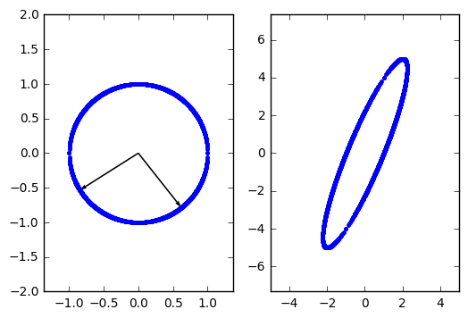

左边是一个单位圆u，右边是所有$Au$点的集合，A拉伸了单位圆。

### 2.8 奇异值分解

**奇异值分解**（singular value decomposition, SVD）将矩阵分解为**奇异向量**（singular vector）和**奇异值**（singular value），是另一种分解矩阵的方法。奇异值分解有更广泛的应用。每个实数矩阵都有一个奇异值分解，但不一定都有特征分解。例如，非方阵的矩阵没有特征分解，这时我们只能使用奇异值分解。

在奇异值分解中，我们可以把 $A$ 写成:

$$A = UDV^T $$

矩阵形状:
- $A$: $m$ x $n$
- $U$: $m$ x $m$
- $D$: $m$ x $n$
- $V$: $n$ x $n$

**性质**:

- $U$ 和$V$ 都定义为正交矩阵. 
- $D$ 是对角矩阵（不一定是方阵），其对角线上的元素被称为矩阵A的 **奇异值(singular values)**.
- 矩阵 $U$的列向量被称为**左奇异向量(left-singular vectors)** (是 $AA^T$的特征向量) ，矩阵$V$ 的列向量被称为 **右奇异向量(right-singular vectors)** (是 $A^TA$的特征向量).$A$ 的非零奇异值是$A^TA$特征值的平方根，同时也是 $AA^T$特征值的平方根。
- SVD最有用的一个性质可能是拓展矩阵求逆到非方矩阵上。


### 2.9 Moore-Penrose 伪逆

假设我们希望通过矩阵$A$($m$ x $n$)的左逆 $B$ 来求解线性方程:
$$ Ax = y \Rightarrow x = By$$ 

如果矩阵A 的行数大于列数，那么上述方程可能没有解。如果矩阵A 的行数小于列数，那么上述矩阵可能有多个解。

矩阵$A$ 的伪逆定义为:

$$A^+ = \lim\limits_{\alpha \rightarrow 0} (A^TA + \alpha I)^{-1}A^T$$

计算伪逆的实际算法没有基于这个定义，而是使用下面的公式：

$$ A^+ = VD^+U^T $$

其中矩阵 $U$, $D$ 和$V$ 是矩阵$A$ 奇异值分解后得到的矩阵，对角矩阵$D$的伪逆 $D^+$ 是其非零元素取倒数之后再转置得到的。

**Case 1**: m <= n

使用伪逆$A^+$求解线性方程是众多可能解法中的一种,下式是方程所有可行解中欧几里得范数$||x||_2$最小的一个:

$$ x = A^{+}y $$

**Case 2**: m > n

可能没有解，通过伪逆 $A^+$ 得到的 $x$ 使得$Ax$ 和 $y$ 的欧几里得矩阵 $||Ax - y||_2$最小.

### 2.10 迹运算

迹运算返回的是矩阵对角元素的和：

$$ Tr(A) = \sum_{i}A_{i,i}$$

性质:

- $||A||_F = \sqrt{Tr(AA^T)} $ (**Frobenius Norm**矩阵范数的另一种描述方式)
- $Tr(A) = Tr(A^T)$ (**Transpose Invariance**迹运算在转置运算下是不变的)
- $Tr(ABC) = Tr(CAB) = Tr(BCA)$ (**Cyclical Invariance** given that the individual matrix multiplications are defined，矩阵中的最后一个挪到最前面)
- a=Tr(a)，标量在迹运算后仍然是自己

即使循环置换后矩阵乘积得到的矩阵形状变了，迹运算的结果依然不变。

### 2.11行列式

行列式determinant记作$det(A)$ ，是一个将方阵$A$映射到实数的函数。

行列式等于矩阵特征值的乘积。

行列式的绝对值可以用来衡量矩阵参与矩阵乘法后空间扩大或者缩小了多少。如果行列式是0，那么空间至少沿着某一维完全收缩了，使其失去了所有的体积。如果行列式是1，那么这个转换保持空间体积不变。

### 2.12 实例：主成分分析

主成分分析（principal components analysis, PCA）是一个简单的机器学习算法，可以通过基础的线性代数知识推导。

假设在$R^n $空间中我们有m 个点{$x^{(1)},...,x^{(m)}$}，我们希望对这些点进行有损压缩。有损压缩表示我们使用更少的内存，但损失一些精度去存储这些点。我们希望损失的精度尽可能少。

一种编码这些点的方式是用低维表示。


## 第3章 概率与信息论

概率论是用于表示不确定性声明的数学框架。它不仅提供了量化不确定性的方法，也提供了用于导出新的不确定性声明（statement）的公理。在人工智能领域，概率论主要有两种用途。首先，概率法则告诉我们AI 系统如何推理，据此我们设计一些算法来计算或者估算由概率论导出的表达式。其次，我们可以用概率和统计从理论上分析我们提出的AI 系统的行为。

概率论使我们能够提出不确定的声明以及在不确定性存在的情况下进行推理，而信息论使我们能够量化概率分布中的不确定性总量。

### 3.1 为什么要使用概率？

机器学习通常必须处理不确定量，有时也可能需要处理随机(非确定性的) 量。

几乎所有的活动都需要一些在不确定性存在的情况下进行推理的能力。

不确定性有三种可能的来源：

-  被建模系统内在的随机性
- 不完全观测
- 不完全建模

在医生诊断病人的例子中（不是可重复实验），我们用概率来表示一种信任度（degree of belief），其中1 表示非常肯定病人患有流感，而0 表示非常肯定病人没有流感。前面那种概率（可重复实验），直接与事件发生的频率相联系，被称为**频率派概率**（frequentist probability）；而后者，涉及到确定性水平，被称为**贝叶斯概率**（Bayesian probability）。

关于不确定性的常识推理，如果我们已经列出了若干条我们期望它具有的性质，那么满足这些性质的唯一一种方法就是将贝叶斯概率和频率派概率视为等同的。例如，如果我们要在扑克牌游戏中根据玩家手上的牌计算她能够获胜的概率，我们使用和医生情境完全相同的公式，就是我们依据病人的某些症状计算她是否患病的概率。

### 3.2 随机变量

随机变量（random variable）是可以随机地取不同值的变量。

就其本身而言，一个随机变量只是对可能的状态的描述；它必须伴随着一个概率分布来指定每个状态的可能性。

### 3.3 概率分布

概率分布（probability distribution）用来描述随机变量或一簇随机变量在每一个可能取到的状态的可能性大小。

#### 3.3.1 离散型变量和概率质量函数

离散型变量的概率分布可以用**概率质量函数**（probability mass function, PMF）来描述。我们通常用大写字母P 来表示概率质量函数。

概率质量函数将随机变量能够取得的每个状态映射到随机变量取得该状态的概率。可以表示为x ~ $P(\text{x})$，其中$P(x)$ 表示 $P(\text{x} = x)$，即x取$x$的概率。

概率质量函数可以同时作用于多个随机变量。这种多个变量的概率分布被称为**联合概率分布**（joint probability distribution）。$P$(x = $x$, y = $y$) 表示x = $x$ 和y = $y$ 同时发生的概率。也可以简写为$P(x,y)$。

如果一个函数P 是随机变量x 的PMF，必须满足下面这几个条件：

- P 的定义域必须是x 所有可能状态的集合。

- $\forall x \in $ x, $ 0 \leq P(x) \leq 1$。不可能发生的事件概率为0，并且不存在比这概率更低的状态。类似的，能够确保一定发生的事件概率为1，而且不存在比这概率更高的状态。
- $ \sum_{x \in \text{x}} P(x) = 1$ (normalization)，我们把这条性质称之为归一化的（normalized）。如果没有这条性质，当我们计算很多事件其中之一发生的概率时可能会得到大于1 的概
  率。

例如，服从均匀分布的离散型随机变量x有k个不同的状态。

```
import matplotlib.pyplot as plt
import numpy as np
%matplotlib inline
k = 10
x = range(1, k+1)
prob = [float(1)/k] * k
plt.scatter(x, prob)
plt.xticks(np.arange(min(x), max(x)+1, 1.0))
plt.show()
```

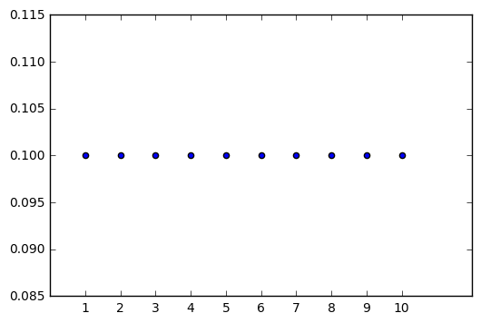
$$

$$
#### 3.3.2 连续型变量和概率密度函数

当我们研究的对象是连续型随机变量时，我们用概率密度函数（probability density function, PDF）而不是概率质量函数来描述它的概率分布。如果一个函数p是概率密度函数，必须满足下面这几个条件：

- p 的定义域必须是x 所有可能状态的集合。
- $\forall x \in$ x, $p(x) \geq 0$ 注意， $p(x)$ 可以大于1（概率密度函数与x轴围成的面积为1，并不代表它在每个点的取值要小于1）
- $\int p(x)dx = 1$

概率密度函数$p(x)$并没有直接对特定的状态给出概率，相对的，它给出了落在面积为$\delta x$的无限小的区域内的概率为$p(x)\delta x$。

因此 $x$ 落在区间 $[a,b]$的概率是: $\int_{[a,b]} p(x)dx$. 

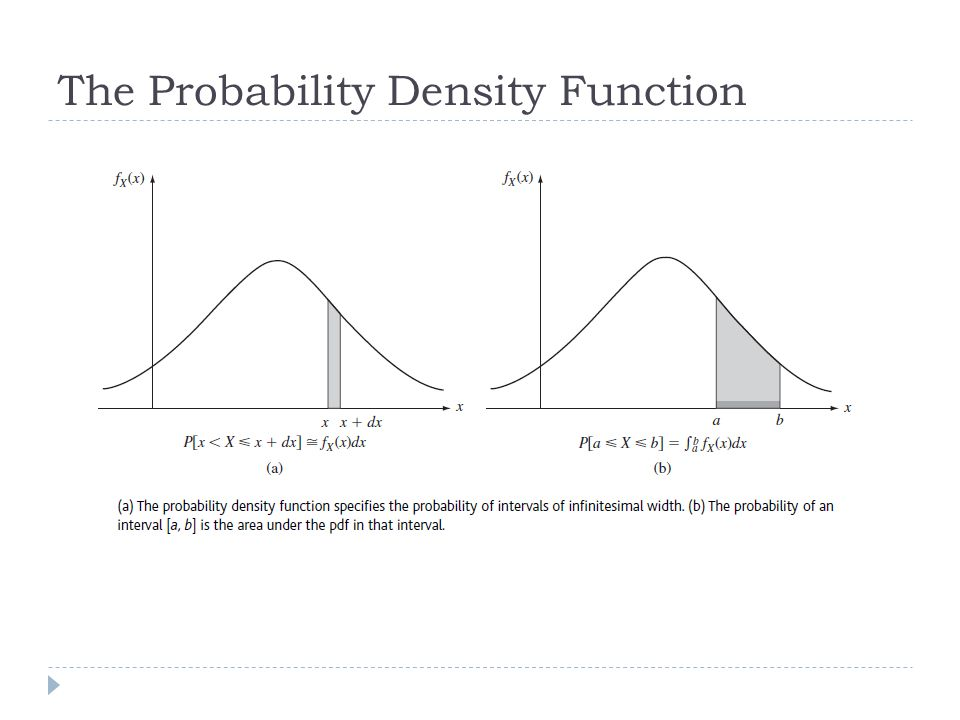

例如实数区间上的均匀分布，表示为$ x \sim U(a, b) $，相应的函数$u(x; a,b)$（其中";"表示"以什么为参数"）为：
$$
u(x; a,b) = 
     \begin{cases}
       \frac{1}{b-a} &\quad \text{for } x \in [a, b]\\
       0 &\quad otherwise
     \end{cases}
$$


```
import matplotlib.pyplot as plt
import numpy as np

a = 2
b = 4

value = float(2) / 4
x = [a, b]
y = [value, value]
plt.plot(x, y)
plt.xticks(range(10))
plt.show()
```

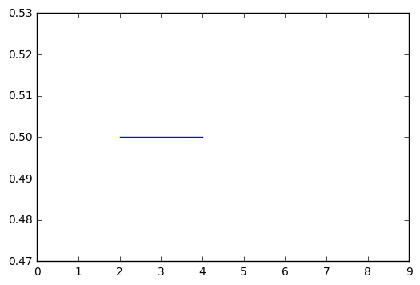

### 3.4 边缘概率

有时候，我们知道了一组变量的联合概率分布，但想要了解其中一个子集的概率分布。这种定义在子集上的概率分布被称为**边缘概率分布**（marginal probability distribution）。

例如，假设有离散型随机变量x和y，并且我们知道 $P(\text{x}, \text{y})$, 我们可以根据求和法则(sum rule)来计算 $P(\text{x})$ :
$$ \forall x \in \text{x}, P(\text{x} = x) = \sum_{y} P(\text{x} = x, \text{y} = y)$$

下图展示了计算边缘概率的方法: 

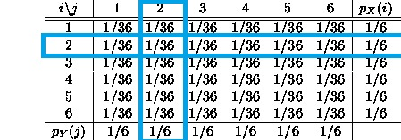

对于连续型变量，我们需要用积分替代求和：

$p(x)=\int p(x,y)dy$

### 3.5 条件概率

在很多情况下，我们感兴趣的是某个事件，在给定其他事件发生时出现的概率。这种概率叫做条件概率。我们将给定$\text{x}=x,\text{y}=y$ 发生的条件概率记为$P(\text{y}=y|\text{x}=x)$. 这个条件概率可以通过下面的公式计算:

$$ P(\text{y} = y \hspace{.1cm}| \hspace{.1cm} \text{x} = x) = \frac{P(\text{y} = y , \text{x} = x)}{P(\text{x} = x)} $$

条件概率只在 $P(\text{x} = x) > 0$ 时有定义。我们不能计算给定在永远不会发生的事件上的条件概率。

$P(X \hspace{.1cm}| \hspace{.1cm} Y)$

这里需要注意的是，不要把条件概率和计算当采用某个动作后会发生什么相混淆。假定某个人说德语，那么他是德国人的条件概率是非常高的，但是如果随机选择的一个人会说德语，他的国籍不会因此而改变。计算一个行动的后果被称为干预查询（intervention query）。干预查询属于因果模型（causal modeling）的范畴。

### 3.6 条件概率的链式法则

任何多维随机变量的联合概率分布，都可以分解成只有一个变量的条件概率相乘的形式。

这个规则被称为概率的**链式法则**（chain rule）或者**乘法法则**（product rule）。

从条件概率的定义可以得到: $ P(\text{b}, \text{c}) = P(\text{b} \hspace{.1cm} | \hspace{.1cm} \text{c}) P(\text{c}) $. 
我们想要分解 $P(\text{a}, \text{b}, \text{c})$. 应用条件概率的公式到 $P(\text{a}, \text{b}, \text{c})$, 有:

$$ P(\text{a}, \text{b}, \text{c}) = P(\text{a} \hspace{.1cm} | \hspace{.1cm} \text{b}, \text{c})P(\text{b}, \text{c}) $$
$$\Rightarrow P(\text{a}, \text{b}, \text{c}) = P(\text{a} \hspace{.1cm} | \hspace{.1cm} \text{b}, \text{c})P(\text{b} \hspace{.1cm} | \hspace{.1cm} \text{c}) P(\text{c})
$$

一般形式:
$$P(\text{x}^{(1)}, ..., \text{x}^{(n)}) = P(\text{x}^{(1)}) \prod_{i=2}^{n} P(\text{x}^{(i)} \hspace{.1cm} | \hspace{.1cm} \text{x}^{(1)},..., \text{x}^{(i-1)}) $$

### 3.7 独立性和条件独立性

两个随机变量x 和y，如果它们的概率分布可以表示成两个因子的乘积形式，并且一个因子只包含x 另一个因子只包含y，我们就称这两个随机变量是**相互独立**的（independent）(x $\perp$ y) :  

$$ \forall x \in \text{x}, y \in \text{y}, P(\text{x} = x, \text{y} = y) = P(\text{x} = x)P(\text{y} = y) $$

利用条件概率的定义，这意味着:  $$ P(\text{x} = x, \text{y} = y) = P(\text{x} = x \hspace{.1cm} | \hspace{.1cm}  \text{y} = y)P(\text{y} = y)=  P(\text{x} = x)P(\text{y} = y)$$
$$ \Rightarrow P(\text{x} = x \hspace{.1cm} | \hspace{.1cm}  \text{y} = y)=  P(\text{x} = x)$$
类似地, $P(\text{y} = y \hspace{.1cm} | \hspace{.1cm}  \text{x} = x)=  P(\text{y} = y)$. 然而，这种情形很少见. 更常见的现象是**条件独立 (conditional independence)**. 如果关于x 和y 的条件概率分布对于z 的每一个值都可以写成乘积的形式，那么这两个随机变量x 和y 在给定随机变量z 时是条件独立的（conditionally independent）(x $\perp$ y | z) :  

$$ \forall x \in \text{x}, y \in \text{y}, \forall z \in \text{z}, P(\text{x} = x, \text{y} = y \hspace{.1cm} | \hspace{.1cm}  \text{z} = z) = P(\text{x} = x \hspace{.1cm} | \hspace{.1cm} \text{z} = z)P(\text{y} = y \hspace{.1cm} | \hspace{.1cm} \text{z} = z) $$


### 3.8 期望、方差和协方差

函数$f(x)$关于某分布$P(x)$的**期望(expectation)**, 或者**期望值(expected value)是指，当x由$P$产生，$f$作用于$x$时，$f(x)$的平均值。对于离散型随机变量，这可以通过求和得到 ：

$$ \mathbb{E}_{x \sim P}[f(x)] = \sum_{x} P(x)f(x) $$ 

对于连续型随机变量可以通过求积分得到:
$$ \mathbb{E}_{x \sim p}[f(x)] = \int p(x)f(x) $$

$f(x)$ 的期望可以简写为 $\mathbb{E}[f(x)]$. 期望是线性的，其中$\alpha$和$\beta$不依赖于$x$: 

$$ \mathbb{E}_{x}[\alpha f(x) + \beta g(x)] = \alpha \mathbb{E}_{x}[f(x)] + \beta \mathbb{E}_{x}[g(x)]$$

**方差(Variance)** 衡量的是当我们对$x$依据它的概率分布进行采样时，随机变量x的函数值会呈现多大的差异 (表示为 $\sigma$): 
$$ Var(f(x)) = \mathbb{E}[(f(x) - \mathbb{E}[f(x)])^2] $$

当方差很小时，$f(x) $的值形成的簇比较接近它们的期望值。方差的平方根被称为**标准差**（standard deviation）。

**协方差**（covariance）在某种意义上给出了两个变量线性相关性的强度以及这些变量的尺度：

$$ Cov(f(x), g(y)) = \mathbb{E}[(f(x) - \mathbb{E}[f(x)])(g(y) - \mathbb{E}[g(y)])] $$

协方差的绝对值如果很大则意味着变量值变化很大并且它们同时距离各自的均值很远。如果协方差是正的，那么两个变量都倾向于同时取得相对较大的值。如果协方差是负的，那么其中一个变量倾向于取得相对较大的值的同时，另一个变量倾向于取得相对较小的值，反之亦然。其他的衡量指标如**相关系数**（correlation）将每个变量的贡献归一化，为了只衡量变量的相关性而不受各个变量尺度大小的影响。

协方差和相关性是有联系的，但实际上是不同的概念。

两个变量如果相互独立那么它们的协方差为零，如果两个变量的协方差不为零那么它们一定是相关的。

两个变量如果协方差为零，它们之间一定没有线性关系。独立性比零协方差的要求更强，因为独立性还排除了非线性的关系.

随机变量 $\boldsymbol{x} \in \mathbb{R} ^{n}$ 的**协方差矩阵**(Covariance matrix) 是一个$n$ x $n$ 的矩阵，表示为 $\Sigma$, 并且有:
$$ Cov(x)_{i, j} = Cov(x_i, x_j), i \neq j$$
$$ Cov(x)_{i, i} = Var(x_i)$$
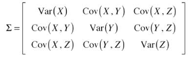

### 3.9 常用概率分布

#### 3.9.1 Bernoulli分布
Bernoulli 分布（Bernoulli distribution）是单个二值随机变量的分布。它由单个参数 $\phi \in [0,1]$控制, $\phi$给出了随机变量等于1的概率。
**一些性质**:

- $P (x = 1) = \phi $ <br>
- $P (x = 0) = 1 − φ$ <br>
- $P (\text{x} = x) = \phi^x(1 − \phi)^{1−x}$ <br>
- $E_x[x] = \phi$ <br>
- $Var_x(x) = \phi(1 − \phi)$ 

#### 3.9.2 Multinoulli分布
Multinoulli 分布（multinoulli distribution）或者范畴分布（categorical distribution）是指在具有k 个不同状态的单个离散型随机变量上的分布，其中k 是一个有限值。Multinouli分布由向量 $\boldsymbol{p} \in [0,1] ^{k-1}$参数化, 其中每一个分量 $p_i$ 表示第 $i$ 个状态的概率. 最后的第$k$个状态的概率可以通过 $(1 - \boldsymbol{1}^T \boldsymbol{p})$ 给出，其中 $\boldsymbol{1}^T \boldsymbol{p} \leq 1$.  

Multinoulli 分布经常用来表示对象分类的分布，所以我们很少假设状态1 具有数值1 之类的。因此，我们通常不需要去计算Multinoulli 分布的随机变量的期望和方差。

Bernoulli 分布和Multinoulli 分布足够用来描述在它们领域内的任意分布。它们能够描述这些分布，不是因为它们特别强大，而是因为它们的领域很简单；它们可以对那些，能够将所有的状态进行枚举的离散型随机变量进行建模。当处理的是连续型随机变量时，会有不可数无限多的状态，所以任何通过少量参数描述的概率分布都必须在分布上加以严格的限制。

#### 3.9.3 高斯分布

实数上最常用的分布就是**正态分布**（normal distribution），也称为**高斯分布**（Gaussian distribution）：
$$ \mathcal{N}(x; \mu, \sigma^2) = \sqrt{\frac{1}{2 \pi \sigma^2}} exp(-\frac{1}{2\sigma^2}(x-\mu)^2)$$

其中 $\mu$ 是分布的均值（给出了中心峰值的坐标）， $\sigma^2$ 表示方差. 
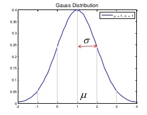

```
import numpy as np
import matplotlib.pyplot as plt
%matplotlib inline

import matplotlib.mlab as mlab

mu = 0.0   # mean of the distribution
variance = 1  # standard deviation

sigma = np.sqrt(variance)
x = np.linspace(mu - 2*sigma, mu + 2*sigma, 100)
plt.plot(x,mlab.normpdf(x, mu, sigma))
plt.show()
```

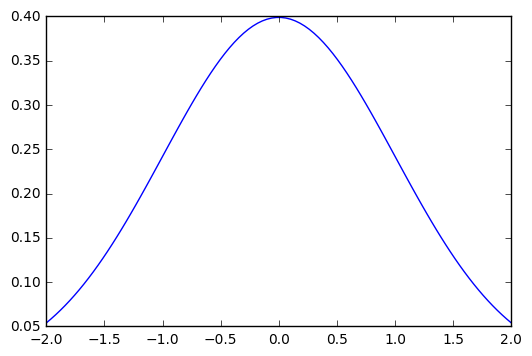

当我们要对概率密度函数求值时，我们需要对 $\sigma$ 平方并且取倒数。当我们需要经常对不同参数下的概率密度函数求值时，一种更高效的参数化分布的方式是使用参数$\beta \in (0,\infty)$，来控制分布的精度（precision）(或方差的倒数)：

$$ \mathcal{N}(x; \mu, \beta^{-1}) = \sqrt{\frac{\beta}{2 \pi}} exp(-\frac{1}{2}\beta(x-\mu)^2)$$

当我们由于缺乏关于某个实数上分布的先验知识而不知道该选择怎样的形式时，正态分布是默认的比较好的选择，其中有两个原因。第一，我们想要建模的很多分布的真实情况是比较接近正态分布的。**中心极限定理**（central limit theorem）说明很多独立随机变量的和近似服从正态分布。第二，在具有相同方差的所有可能的概率分布中，正态分布在实数上具有最大的不确定性。因此，我们可以认为正态分布是对模型加入的先验知识量最少的分布。

正态分布可以推广到 $\mathbb{R}^n$空间, 这种情况下被称为**多维正态分布**（multivariate normal distribution），它的参数是一个正定对称矩阵$\boldsymbol{\Sigma}$。均值 $\boldsymbol{\mu}$ 变成了向量，方差被协方差矩阵 $\boldsymbol{\Sigma}$取代，我们常常把协方差矩阵固定成一个对角阵。一个更简单的版本是**各向同性**（isotropic）高斯分布，它的协方差矩阵是一个标量乘以单位阵。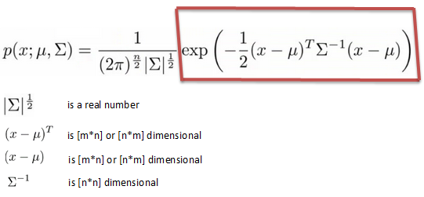

#### 3.9.4 指数分布和Laplace分布

在深度学习中，我们经常会需要一个在x = 0 点处取得边界点(sharp point) 的分布。为了实现这一目的，我们可以使用**指数分布**（exponential distribution）：

$$ p(x; \lambda) = \lambda \hspace{.05cm} 1_{x\geq0} exp(-\lambda x)$$

或

$$ p(x; \lambda) = \lambda \hspace{.05cm} exp(-\lambda x), \forall x \geq 0$$

 $x < 0$ 的概率为0.  一个联系紧密的概率分布是Laplace 分布（Laplace distribution），它允许我们在任意一点$\mu$ 处设置概率质量的峰值：
$$p(x; \mu, \gamma) = \frac{1}{2 \gamma} \hspace{.05cm} exp(-\frac{|x-\mu|}{\gamma})$$


#### 3.9.5 Dirac分布和经验分布

在一些情况下，我们希望概率分布中的所有质量都集中在一个点上。这可以通过**Dirac delta 函数**（Dirac delta function）$\delta(x)$ 定义概率密度函数来实现：

$$p(x)=\delta(x-\mu)$$

Dirac delta 函数被定义成在除了0 以外的所有点的值都为0，但是积分为1。
$$
\\ 
\delta(x) = 
     \begin{cases}
       1 &\quad x = 0\\
       0 &\quad otherwise
     \end{cases}
\\
$$

Dirac delta 函数不像普通函数一样对x 的每一个值都有一个实数值的输出，它是一种不同
类型的数学对象，被称为**广义函数**（generalized function），广义函数是依据积分性质定义的数学对象。我们可以把Dirac delta 函数想成一系列函数的极限点，这一系列函数把除0 以外的所有点的概率密度越变越小。

通过把p(x) 定义成$\delta$ 函数左移$-\mu$个单位，我们得到了一个在$x=\mu$处具有无限窄也无限高的峰值的概率质量。

It can be visualized as a gaussian distribution with mean and variance as 0. 
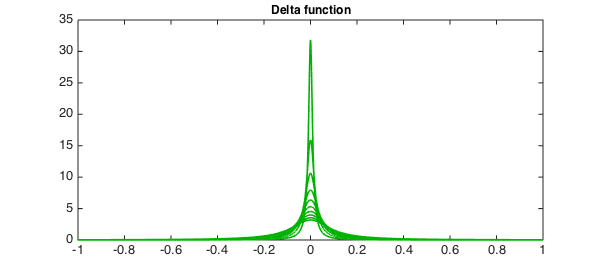

Dirac 分布经常作为**经验分布**（empirical distribution）的一个组成部分出现：
$$ \hat{p}(\boldsymbol{x}) = \frac{1}{m}\sum_{i=1}^{m} \delta(\boldsymbol{x} - \boldsymbol{x}^{(i)}) $$

经验分布将概率密度1/m 赋给m个点 $\boldsymbol{x}^{(i)}, i=1, 2, ... m$. 这些点是给定的数据集或者采样的集合。只有在定义连续型随机变量的经验分布时，Dirac delta 函数才是必要的。对于离散型随机变量，情况更加简单：经验分布可以被定义成一个Multinoulli 分布，对于每一个可能的输入，其概率可以简单地设为在训练集上那个输入值的经验频率（empirical frequency）。

当我们在训练集上训练模型时，我们可以认为从这个训练集上得到的经验分布指明了我们采样来源的分布。关于经验分布另外一种重要的观点是，它是训练数据的似然最大的那个概率密度函数。

####  3.9.6 分布的混合

通过组合一些简单的概率分布来定义新的概率分布也是很常见的。一种通用的组合方法是构造**混合分布**（mixture distribution）。混合分布由一些组件(component)分布构成。每次实验，样本是由哪个组件分布产生的取决于从一个Multinoulli 分布中采样的结果：

$$ P(x) = \sum_{i} P(c = i) P (x \hspace{.1cm} | \hspace{.1cm} c = i) $$

其中$P (c)$ 是对各组件的一个Multinoulli分布。混合模型使我们能够一瞥以后会用到的一个非常重要的概念—— **潜变量**（latent variable）。潜变量是我们不能直接观测到的随机变量。混合模型的组件标识变量c 就是其中一个例子。潜变量在联合分布中可能和x 有关，在这种情况下，$P(x,c)=P(x|c)P(c)$。

潜变量的分布$P(c)$ 以及关联潜变量和观测变量的条件分布$P (x \hspace{.1cm} | \hspace{.1cm} c = i) $，共同决定了分布$P(x)$ 的形状，尽管描述$P(x)$ 时可能并不需要潜变量。

一个非常强大且常见的混合模型是**高斯混合模型**（Gaussian Mixture Model），它的组件$p(x|c=i)$是高斯分布。每个组件都有各自的参数均值和协方差矩阵。

除了均值和协方差以外，高斯混合模型的参数指明了给每个组件i 的**先验概率**（prior probability）$\alpha_i = P(c = i)$。‘‘先验’’ 一词表明了在观测到x 之前传递给模型关于c 的信念。作为对比，是$P(c \hspace{.1cm} | \hspace{.1cm} x)$**后验概率**（posterior probability），因为它是在观测到x 之后进行计算的。高斯混合模型是概率密度的**万能近似器**（universal approximator），在这种意义下，任何平滑的概率密度都可以用具有足够多组件的高斯混合模型以任意精度来逼近。

### 3.10. 常用函数的有用性质

某些函数在处理概率分布时经常会出现，尤其是深度学习的模型中用到的概率分布。 

**logistic sigmoid**函数:

$$ \sigma(x) = \frac{1}{1 + exp(-x)} $$

logistic sigmoid 函数通常用来产生Bernoulli 分布中的参数ϕ，因为它的范围是(0，1)，处在ϕ 的有效取值范围内。通常用在深度学习模型的最后一层（比如分类）。sigmoid 函数在变量取绝对值非常大的正值或负值时会出现**饱和**（saturate）现象，意味着函数会变得很平，并且对输入的微小改变会变得不敏感。

**softplus function**:

$$ \varsigma(x) = log(1+exp(x)) $$

softplus函数可以用来产生正态分布的$\beta$和 $\sigma$参数，因为它的范围是 $(0, \infty)$. 当处理包含sigmoid 函数的表达式时它也经常出现。softplus 函数名来源于它是另外一个函数的平滑（或“软化”形式）: $ x^+ = max(0, x) $

```
import numpy as np
import matplotlib.pyplot as plt
%matplotlib inline

def sigmoid(x):
    return 1 / (1 + np.exp(-x))

def softplus(x):
    return np.log(1 + np.exp(x))

def plot(x, func, label):
    y = func(x)
    plt.plot(x, y, label=label)
    
x = np.linspace(-10, 10, 100)
plot(x, sigmoid, label='sigmoid')
plot(x, softplus, label='softplus')
plt.legend(loc='best')
plt.show()
```

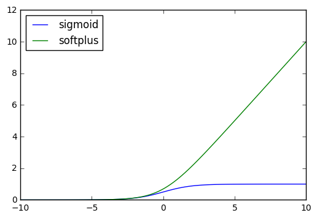

记住一些有用的性质:
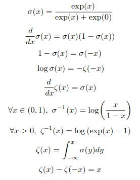

函数$\sigma^{-1}$ 在统计学中被称为**分对数**(logit)，但这个函数在机器学习中很少用到。

负部函数（negative part function）$ x^- = max(0, -x) $，负部函数的一个平滑函数可以是$\zeta(-x)$。

### 3.11. 贝叶斯规则

**贝叶斯规则Bayes' Rule** :

$$ P(x \hspace{.1cm} | \hspace{.1cm} y) = \frac{P(x)P(y \hspace{.1cm} | \hspace{.1cm} x)}{P(y)} $$

其中 $P(y) = \sum_x P(x)P(y \hspace{.1cm}  | \hspace{.1cm} x)$.

### 3.12. 连续型变量的技术细节

连续型随机变量和概率密度函数的深入理解需要用到数学分支**测度论**（measure theory）的相关内容来扩展概率论。测度论更多的是用来描述那些适用于 $\mathbb{R}^n$ 上的大多数点，却不适用于一些边界情况的定理。

- **零测度measure zero**: 测度论提供了一种严格的方式来描述那些非常微小的点集。这种集合被称为“ 零测度（measure zero）’’ 的。我们可以认为零测度集在我们的度量空间中不占有任何的体积。例如，在 $\mathbb{R}^2$空间中,一条直线的测度为零，而填充的多边形具有正的测度。类似的，一个单独的点的测度为零。可数多个零测度集的并仍然是零测度的(所以所有有理数构成的集合测度为零)。 

- **几乎处处almost everywhere**: 某个性质如果是几乎处处都成立的，那么它在整个空间中除了一个测度为零的集合以外都是成立的。因为这些例外只在空间中占有极其微小的量，它们在多数应用中都可以被放心地忽略。概率论中的一些重要结果对于离散值成立但对于连续值只能是‘‘几乎处处’’ 成立。

- 连续型随机变量的另一技术细节，涉及到处理那种相互之间有确定性函数关系**deterministic functions**的连续型变量。假设两个随机变量满足 $\boldsymbol{y} = g(\boldsymbol{x})$. 其中g是可逆、连续可微的函数，可能有人会想 $p_y(\boldsymbol{y}) = p_x(g^{-1}(\boldsymbol{y}))$. 但实际上这并不对. 例如 $y = x/2$，其中 $x$ 服从均匀分布 $U(0, 1)$. 如果我们使用 $p_y(\boldsymbol{y}) = p_x(2y)$ ，那么 $p_y$ 除了区间[0, 1/2]以外都为 $0$ ，并且在这个区间上的值为1. 这意味着:
  $$ \int p_y(y)dy = \frac{1}{2}$$

  而这违背了概率密度的定义(积分为1)。这个常见错误之所以错是因为它没有考虑到引入函数$g$ 后造成的空间变形。回忆一下，x 落在无穷小的体积为 $\delta x$的区域内的概率为 $p_x(x)\delta x$。因为g 可能会扩展或者压缩空间，在x 空间内的包围着x 的无穷小体积在y 空间中可能有不同的体积。

  为了看出如何改正这个问题，我们回到标量值的情况。我们需要保持下面这个性质：

  $$ |p_y(y)\delta y| = |p_x(x)\delta x| $$
  $$ \Rightarrow p_x(x) = p_y(y) \hspace{.1cm} |\frac{\partial g(x)}{\partial x}|$$

  在高维空间中，微分运算扩展为Jacobian 矩阵（Jacobian matrix）的行列式——
  矩阵的每个元素为 $J_{i,j} = \frac{\partial x_i}{\partial y_j}$.

### 3.13. 信息论

信息论**Information theory**是应用数学的一个分支，主要研究的是对一个信号包含信息的多少进行量化。它最初被发明是用来研究在一个含有噪声的信道上用离散的字母表来发送消息，例如通过无线电传输来通信。在这种情况下，信息论告诉我们如何对消息设计最优编码以及计算消息的期望长度，这些消息是使用多种不同编码机制、从特定的概率分布上采样得到的。在机器学习中，我们也可以把信息论应用于连续型变量，此时某些消息长度的解释不再适用。

To give a flavour, given below is what is known as the **Binary Symmetric Channel (BSC)**:
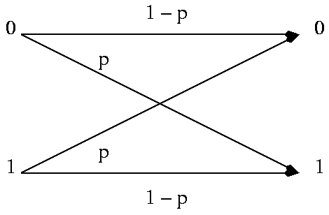

It is named so, because both the input and output can be either $0/1$. $p$ represents the probability that given that we transmitted $0$ (or $1$), we received an error, i.e. $1$ (or $0$ in case $1$ was sent). So, the probability of error in transmission is $p$. Here, we used one bit to represent one message, but we could use another coding scheme where $0$ is represented by $00$ and $1$ is represented by $11$. The advantage here is that the probability of error in transmission reduces in this case, but at the cost of increased number of transmissions. In this case, we are representing $1$ message using $2$ bits. Thus, the rate of the code is $1/2$. Information theory deals with the design of optimal **codes**, that can maximize this rate of transmission.

信息论的基本想法是一个不太可能的事件居然发生了，要比一个非常可能的事件发生，能提供更多的信息。我们想要通过这种基本想法来量化信息。特别地，

- 非常可能发生的事件信息量要比较少，并且极端情况下，确保能够发生的事件应该没有信息量。
- 较不可能发生的事件具有更高的信息量。
- 独立事件应具有增量的信息。例如，投掷的硬币两次正面朝上传递的信息量，应该是投掷一次硬币正面朝上的信息量的两倍。

为了满足上述三个性质，我们定义一个事件x = $x$ 的**自信息**（self-information）为

$$ I(x) = - \text{log} P(x)$$

log 表示自然对数，其底数为e.因此我们定义的I(x) 单位是**奈特**（nats）。一奈特是以1/e 的概率观测到一个事件时获得的信息量。其他的材料中使用底数为2 的对数，单位是**比特**（bit）或者**香农**（shannons）；通过比特度量的信息只是通过奈特度量信息的常数倍。

当x 是连续的，我们使用类似的关于信息的定义，但有些来源于离散形式的性质就丢失了。例如，一个具有单位密度的事件信息量仍然为0，但是不能保证它一定发生。
自信息只处理单个的输出。我们可以用**香农熵**（Shannon entropy）来对整个概率分布中的不确定性总量进行量化（下式也记作$H(P)$）：

$$ H(x) = \mathbb{E}_{x \sim P}[I(x)] = - \mathbb{E}_{x \sim P}[\text{log} P(x)]$$

换言之，一个分布的香农熵是指遵循这个分布的事件所产生的期望信息总量。它给出了对依据概率分布P 生成的符号进行编码所需的比特数在平均意义上的下界(当对数底数不是2 时，单位将有所不同)。那些接近确定性的分布(输出几乎可以确定) 具有较低的熵；那些接近均匀分布的概率分布具有较高的熵。当x 是连续的，香农熵被称为微分熵（differential entropy）。

```
# For the case of a binary random variable, let p 
# represent the probability of the value being 1. Then,
# H(x) = -(P(0)logP(0) + P(1)log(P(1)))
# or H(x) = -(plog(p) + (1-p)log(1-p))

import numpy as np
import matplotlib.pyplot as plt
%matplotlib inline

def entropy(p):
    return -(p*np.log(p) + (1-p)*np.log(1-p))

p_values = np.linspace(1e-7, 1 - 1e-7)
entropy_values = entropy(p_values)
plt.plot(p_values, entropy_values)
```

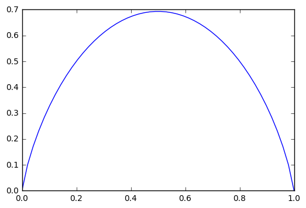

如果我们对于同一个随机变量x 有两个单独的概率分布P(x) 和Q(x)，我们可以使用**KL 散度**（Kullback-Leibler (KL) divergence）来衡量这两个分布的差异：
$$ D_{KL}(P||Q) = \mathbb{E}_{x\sim P} [log\frac{P(x)}{Q(x)}] = \mathbb{E}_{x\sim P} [log P(x) - log Q(x)]$$

在离散型变量的情况下，KL 散度衡量的是，当我们使用一种被设计成能够使得概率分布Q 产生的消息的长度最小的编码，发送包含由概率分布P 产生的符号的消息时，所需要的额外信息量.

KL散度的性质:
- $D_{KL}(P||Q) \geq 0$
- $D_{KL}(P||Q) = 0$ 当且仅当 $P$ 和 $Q$ 在离散型变量的情况下是相同的分布，或者在连续型变量的情况下是‘‘几乎处处’’ 相同的。

因为KL 散度是非负的并且衡量的是两个分布之间的差异，它经常被用作分布之间的某种距离。然而，它并不是真的距离因为它不是对称的：对于某些P 和Q, $D_{KL}(P||Q) \neq D_{KL}(Q||P)$. 这种非对称性意味着选择哪一个影响很大。

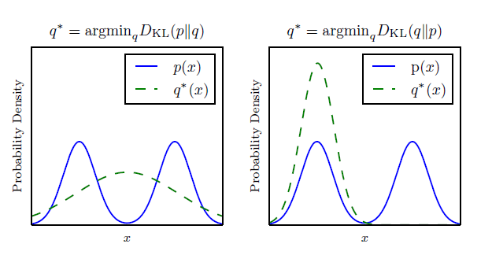

另一个和KL散度密切联系的量是交叉熵 **cross-entropy**: $H(P, Q) = H(P) + D_{KL}(P||Q)$. ，它和KL散度很像但是缺少左边一项：

$$ H(P, Q) = -\mathbb{E}_{x\sim P} [log{Q(x)}] $$ 

针对$Q$最小化交叉熵等价于最小化KL散度，因为$Q$不参与被省略的那一项。最小化 KL 散度在计算上是不可行的, 因此，我们转向最小化交叉熵.

$lim_{x\to 0}xlogx=0$

### 3.14. 结构化概率模型

机器学习的算法经常会涉及到在非常多的随机变量上的概率分布。通常，这些概率分布涉及到的直接相互作用都是介于非常少的变量之间的。使用单个函数来描述整个联合概率分布是非常低效的(无论是计算上还是统计上)。

Suppose, we have 3 variables $a$, $b$ and $c$, such that $a$ can have 3 values, $b$ can have 2 and $c$ 4. Also, $a$ influences the value of $b$ which, in turn, influences the value of $c$. But given $b$, $a$ and $c$ are independent. Thus, if we wanted to use a single function to represent the joint distribution of $a$, $b$ and $c$:
$$ P(a, b, c) = P(a)P(b | a)P(c | a,b)$$ 

which we get using the chain rule. Here, we are doing unnecessary computations because since $c$ is independent of $a$ given $b$, $P(c | a,b) = P(c | b)$. So, instead of computing at $3$ (# values of a) x $2$ (# values of b) cases, we just need to compute $2$ cases. Thus, it is better to factorize a probability distribution to reduce the number of parameters. Thus:
$$ P(a, b, c) = P(a)P(b | a)P(c | b)$$ 

我们可以用图来描述这种分解。这里我们使用的是图论中的‘‘图’’ 的概念：由一些可以通过边互相连接的顶点的集合构成。当我们用图来表示这种概率分布的分解，我们把它称为**结构化概率模型**（structured probabilistic model）或者**图模型**（graphical model）。

有两种主要的结构化概率模型：有向的和无向的。

**有向**（directed）模型使用带有有向边的图，它们用条件概率分布来表示分解，就像上面的例子。特别地，有向模型对于分布中的每一个随机变量$x_i$ 都包含着一个影响因子，这个组成$x_i$条件概率的影响因子被称为$x_i$的父节点，记为$Pa_{\mathcal{G}}(x_i)$：
$$ p(\boldsymbol{x}) = \prod_{i} p(x_i \hspace{.1cm} | \hspace{.1cm} Pa_{\mathcal{G}}(x_i)) $$
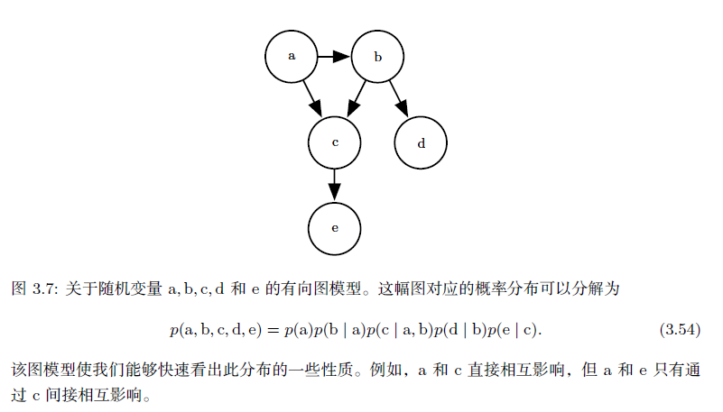

**无向**（undirected）模型使用带有无向边的图，它们将分解表示成一组函数；不像有向模型那样，这些函数通常不是任何类型的概率分布。G 中任何满足两两之间有边连接的顶点的集合被称为团(clique)。无向模型中的每个团$C^{(i)}$都伴随着一个因子$\phi^{(i)}(C^{(i)})$。这些因子仅仅是函数，并不是概率分布。每个因子的输出都必须是非负的，但是并没有像概率分布中那样要求因子的和或者积分为1。
随机变量的联合概率与所有这些因子的乘积成比例（proportional）——意味着因子的值越大则可能性越大。当然，不能保证这种乘积的求和为1。所以我们需要除以一个归一化常数Z 来得到归一化的概率分布，归一化常数Z 被定义为$\phi$函数乘积的所有状态的求和或积分。概率分布为：

$$ p(\boldsymbol{x}) = \frac{1}{Z}\prod_{i} \phi^{(i)}(C^{(i)}) $$
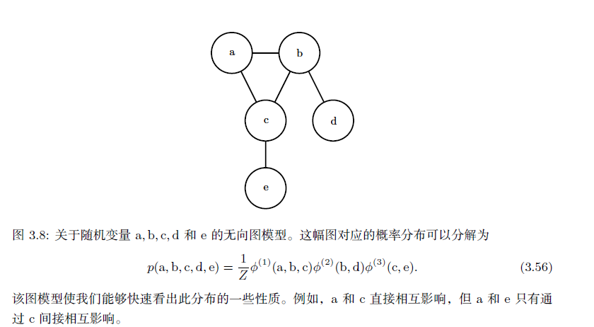


