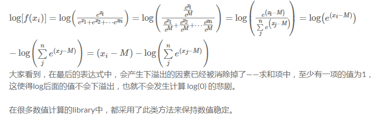
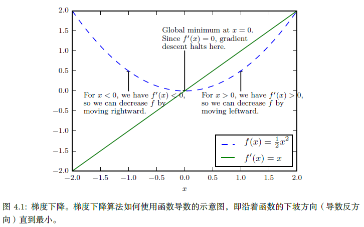
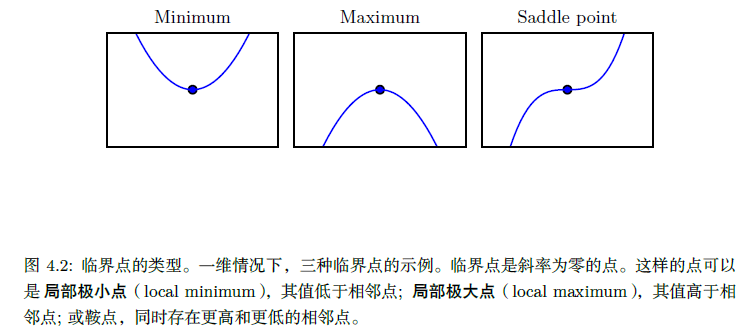
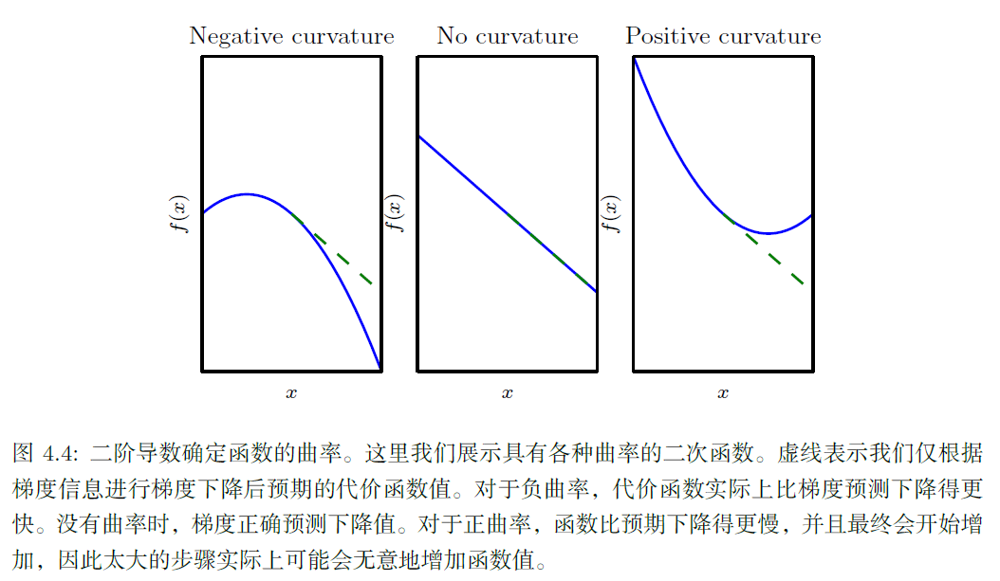
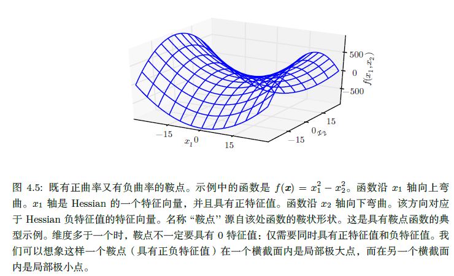
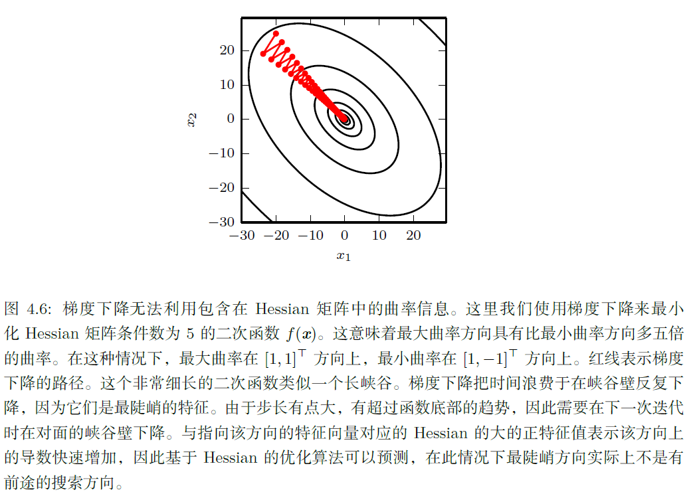

## 第四章 数值计算

### 4.1 上溢和下溢

下溢（underflow）：当接近零的数被四舍五入为零时发生下溢。

上溢（overflow）：当大量级的数被近似为$\infty$或 $-\infty$时发生上溢。

必须对上溢和下溢进行数值稳定的一个例子是softmax 函数（softmax function），softmax 函数经常用于预测与Multinoulli 分布相关联的概率，定义为

$softmax(x)_i = \frac {exp(x_i)}{\sum_{j=1}^n exp(x_j)}$

假设每个$x_i$等于某个常数$c$。

存在的问题：

- 当c是一个非常小的负数时，会导致exp(c)下溢，softmax函数的分母变成0
- 当c是一个非常大的整数时，会导致exp(c)上溢，导致整个表达式未定义。

解决方案：

我们用$softmax(z)$替代$softmax(x)$，其中$z=x-max_i x_i$。很容易证明softmax函数的输入向量减去或加上标量($max_i x_i$是一个常数)并不会改变softmax的函数值。$z$的最大值是0，避免了上溢；同样地，分母中至少有一个值为1的项，排除了因分母下溢而导致被零除的可能性。

但还有一个小问题：

分子中的下溢仍可以导致整体表达式被计算为零。这意味着，如果我们在计算log softmax(x) 时，先计算softmax 再把结果传给log 函数，会错误地得到$-\infty$。相反，我们必须实现一个单独的函数，并以数值稳定的方式计算log softmax。我们可以使用相同的技巧来稳定log softmax 函数。

### 4.2 病态条件

**条件数**表征函数相对于输入的微小变化而变化的快慢程度。输入被轻微扰动而迅速改变的函数对于科学计算来说可能是有问题的，因为输入中的舍入误差可能导致输出的巨大变化。

一个低**条件数**的问题称为良态的，而高**条件数**的问题称为病态（或者说非良态）的。 

考虑函数 $ f(x) = A^{-1}x$. 当 $A \in \mathbb{R}^{n \hspace{.1cm} \text{x} \hspace{.1cm} n}$ 具有特征值分解时，其条件数为

$$ max_{i,j} |\frac{\lambda_i}{\lambda_j}|$$

这是最大和最小特征值的模之比(与通常的条件数定义有所不同)。当该数很大时，矩阵求逆对输入的误差特别敏感。

这种敏感性是矩阵本身的固有特性，而不是矩阵求逆期间舍入误差的结果。即使我们乘以完全正确的矩阵逆，病态条件的矩阵也会放大预先存在的误差。在实践中，该错误将与求逆过程本身的数值误差进一步复合。

更多条件数参考：https://blog.csdn.net/u011584941/article/details/44625779 

### 4.3 基于梯度的优化方法

优化指的是改变x 以最小化或最大化某个函数 $f(x)$的任务。最大化可经由最小化算法最小化$-f(x)$ 来实现。

我们把要最小化或最大化的函数称为**目标函数**（objective function）或**准则**（criterion）。当我们对其进行最小化时，我们也把它称为**代价函数**（cost function）、**损失函数**（loss function）或**误差函数**（error function）。

函数 $f$的**导数**(derivative) , 记为 $f'(x)$, 它表明如何缩放输入的小变化才能在输出获得相应的变化：: $f(x + \epsilon) \approx f(x) + \epsilon * f'(x)$. 

因此导数对于最小化一个函数很有用，因为它告诉我们如何更改x 来略微地改善y。

例如对于足够小的 $\epsilon$, $f\Big(x - \epsilon\, sign\big(f'(x)\big) \Big)$ 是比$f(x)$小的. 这种技术被称为**梯度下降 **(gradient descent).

$f'(x)=0$ 的点称为**临界点 **(critical point) 或**驻点 **(stationary point). 临界点的类型：

有些临界点既不是最小点也不是最大点。这些点被称为鞍点（saddle point）。

使f(x) 取得绝对的最小值（相对所有其他值）的点是全局最小点（global minimum）。在深度学习的背景下，我们要优化的函数可能含有许多不是最优的局部极小点，或者还有很多处于非常平坦的区域内的鞍点。尤其是当输入是多维的时候，所有这些都将使优化变得困难。因此，我们通常寻找使f 非常小的点，但这在任何形式意义下并不一定是最小。

针对具有多维输入的函数$f: \mathbb{R}^m \rightarrow \mathbb{R}$，**偏导数 **(partial derivative) $\frac{\partial}{\partial x_i}f(x)$ 衡量点$x$处只有$x_i$增加时 $f(x)$ 如何变化。**梯度**(gradient) 是相对一个向量求导的导数：$f$ 的导数是包含所有偏导数的向量，记为 $\nabla_x\, f(x)$. 梯度的第i个元素是f关于$x_i$的偏导数，在多维情况下，临界点是梯度中所有元素都为零的点。

**偏导数指的是多元函数沿坐标轴的变化率，但是我们往往很多时候要考虑多元函数沿任意方向的变化率，那么就引出了方向导数.**

在 ***u*** (单位向量) 方向的**方向导数**(directional derivative)是函数$f$ 在$u$方向的斜率.

即方向导数是函数$f(x+\alpha*u)$（沿着u的方向，极小的变化）关于$\alpha$的导数。使用链式法则，当 $\alpha= 0$时：

$\frac{\partial}{\partial \alpha}f(x+\alpha*u) = \big(\frac{\partial}{\partial \alpha}(x+\alpha*u)\big)^T\frac{\partial}{\partial(x+\alpha*u)}f(x+\alpha*u)=u^T\nabla_x\, f(x)$

为了最小化 $f$ 我们希望找到使 $f$下降得最快的方向，即计算方向导数:

$min_{u,u^Tu=1}u^T\nabla_x\, f(x)=min_{u,u^Tu=1}||u||_2||\nabla_x\, f(x)||_2 cos\theta$

其中$\theta$是$u$与梯度的夹角，将$||u||_2=1$代入，并忽略与$u$无关的项，就能简化得到$min_ucos\theta$，在$u$与梯度方向相反时取得最小值。换句话说，梯度向量指向上坡，负梯度向量指向下坡。我们在负梯度方向上移动可以减小$f$。这被称为**最速下降法**(method of steepest descent) 或**梯度下降**（gradient descent）。

最速下降建议新的点为: $x' = x - \epsilon \nabla_x\, f(x)$ 

其中 $\epsilon$ 为**学习率 **(learning rate)，是一个确定步长大小的正标量. $\epsilon$ 可以是一个小常数，也可以通过计算选择使方向导数消失的步长。还有一种方法是根据几个 $\epsilon$ 计算$f(x - \epsilon \nabla_x\, f(x))$，并选择其中能产生最小目标函数值的$\epsilon$，这种策略被称为线搜索 (**line search**).

最速下降在梯度的每一个元素为零时收敛（或在实践中，很接近零时）。在某些情况下，我们也许能够避免运行该迭代算法，并通过解方程$\nabla_x\, f(x)= 0$ 直接跳到临界点。
虽然梯度下降被限制在连续空间中的优化问题，但不断向更好的情况移动一小步（即近似最佳的小移动）的一般概念可以推广到离散空间。递增带有离散参数的目标函数被称为**爬山**（hill climbing）算法(Russel and Norvig, 2003)。

#### 4.3.1 梯度之上：Jacobian 和Hessian 矩阵

有时我们需要计算输入和输出都为向量的函数的所有偏导数。包含所有这样的偏导数的矩阵被称为**Jacobian **矩阵。函数 $f: \mathbb{R}^m \rightarrow \mathbb{R}^n$的 **Jacobian** 矩阵 $J \in \mathbb{R}^{n\, \times\, m}$ 定义为$J_{i,j} = \frac{\partial}{\partial x_j}f(x)_i$

**二阶导数**(second derivative) 告诉我们一阶导数将如何随着输入的变化而变化。 它表示只基于梯度信息的梯度下降步骤是否会产生如我们预期的那样大的改善，因此它是重要的。我们可以认为，二阶导数是对曲率(curvature)的衡量。曲线的曲率表明曲线在某一点的弯曲程度的数值，就是针对曲线上某个点的切线方向角对弧长的转动率。

下图可以看出不同形式的曲率如何影响基于梯度的预测值与真实的代价函数值的关系。（想象一维的情况）

二阶导数合并成一个矩阵，称为**Hessian** 矩阵 **H**(f)(**x**) ，定义为

$H(f)(x)_{i,j} = \frac{\partial^2}{\partial x_i \partial x_j}f(x)$

Hessian等价于梯度的Jacobian矩阵.

微分算子在任何二阶偏导连续的点处可交换，也就是它们的顺序可以互换：

$\frac{\partial^2}{\partial x_i \partial x_j}f(x)=\frac{\partial^2}{\partial x_j \partial x_i}f(x)$

这意味着$H_{i,j} = H_{j,i}$ ，Hessian矩阵在这些点上是对称的. 在深度学习背景下，我们遇到的大多数函数的Hessian 几乎处处都是对称的。

因为Hessian 矩阵是实对称的，我们可以将其分解成一组实特征值和一组特征向量的正交基。

在特定方向 **d**(unit vector) 上的二阶导数可以写成 $\mathbf{d^THd}$.（二阶方向导数的公式）

$$\nabla_u^2f=\nabla_u(u^T\nabla f)=\nabla_u(\nabla^T f)u=u^T\nabla (\nabla^T f)u=u^THu$$

参考：https://blog.csdn.net/tina_ttl/article/details/51202566

当 **d** 是$H$的一个特征向量时, 这个方向的二阶导数就是对应的特征值。对于其他的方向$d$，方向二阶导数是所有特征值的加权平均，权重在0和1之间，且与$d$夹角越小的特征向量的权重越大。最大特征值确定最大二阶导数，最小特征值确定最小二阶导数。

我们可以通过（方向）二阶导数预期一个梯度下降步骤能表现得多好。我们在当前点 $\mathbf{x^{(0)}}$处作函数$f(\mathbf{x})$的近似二阶泰勒级数：

$f(\mathbf{x}) \approx f(\mathbf{x^{(0)}}) + (\mathbf{x}-\mathbf{x^{(0)}})^T\mathbf{g} + \frac{1}{2}(\mathbf{x}-\mathbf{x^{(0)}})^T\mathbf{H}(\mathbf{x}-\mathbf{x^{(0)}})$ 

其中 **g** 是梯度， **H** 是$x^{(0)}$点的Hessian。

如果我们使用学习率$\epsilon$，新的点$x$将会是 $(\mathbf{x^{(0)}} - \epsilon \mathbf{g})$. 代入上述的近似，可得:

$f(\mathbf{x^{(0)}} - \epsilon \mathbf{g}) \approx f(\mathbf{x^{(0)}}) - \epsilon \mathbf{g}^T\mathbf{g} + \frac{1}{2}\epsilon^2\mathbf{g}^T\mathbf{H}\mathbf{g}$

其中有3 项：函数的原始值、函数斜率导致的预期改善、函数曲率导致的校正。当最后一项太大时，梯度下降实际上是可能向上移动的。当$\mathbf{g}^T\mathbf{H}\mathbf{g}$为零或负时，近似的泰勒级数表明增加$\epsilon$将永远使$f$ 下降。在实践中，泰勒级数不会在$\epsilon$大的时候也保持准确，因此在这种情况下我们必须采取更启发式的选择。当$\mathbf{g}^T\mathbf{H}\mathbf{g}$为正时，通过计算可得，使近似泰勒级数下降最多的最优步长为 

$\epsilon^* = \frac{\mathbf{g}^T\mathbf{g}}{\mathbf{g}^T\mathbf{H}\mathbf{g}}$

最坏的情况下，**g** 与 **H** 最大特征值 ($\lambda_{max}$) 对应的特征向量对齐，则最优步长是 $\frac{1}{\lambda_{max}}$. 我们要最小化的函数能用二次函数很好地近似的情况下，Hessian 的特征值决定了学习率的量级。

在临界点处 $f'(x) = 0$, 二阶导数还可以被用于确定一个临界点是否是局部极大点、局部极小点或鞍点，这就是**二阶导数测试**(second derivative test）：

| $f''(x)\, $ | conclusion                     |
| ----------- | ------------------------------ |
| $>0$        | 局部极小点                     |
| $<0$        | 局部极大点                     |
| $=0$        | 不确定(鞍点或平坦区域的一部分) |

在多维情况下，在临界点处($\nabla_x\, f(x)= 0$)，通过检测Hessian的特征值来判断该临界点是一个局部极大点、局部极小点还是鞍点:

| eigenvalue                                      | conclusion |
| ----------------------------------------------- | ---------- |
| 均为正(Hessian正定，方向二阶导数在任意方向为正) | 局部极小点 |
| 均为负(Hessian负定)                             | 局部极大点 |
| 至少一个是正的且至少一个是负的                  | 鞍点saddle |
| 所有非零特征值是同号的且至少有一个特征值是0     | 不确定     |

多维情况下，单个点处每个方向上的二阶导数是不同。Hessian 的条件数衡量这些二阶导数的变化范围。当Hessian 的条件数很差时，梯度下降法也会表现得很差。这是因为一个方向上的导数增加得很快，而在另一个方向上增加得很慢。梯度下降不知道导数的这种变化，所以它不知道应该优先探索导数长期为负的方向。病态条件也导致很难选择合适的步长。步长必须足够小，以免冲过最小而向具有较强正曲率的方向上升。这通常意味着步长太小，以致于在其他较小曲率的方向上进展
不明显。见图4.6 的例子。

我们可以使用Hessian 矩阵的信息来指导搜索，以解决这个问题。其中最简单的方法是**牛顿法**（Newton’s method）。牛顿法基于一个二阶泰勒展开来近似$x^{(0)}$ 附近的$f(x)$：

$f(\mathbf{x}) \approx f(\mathbf{x^{(0)}}) + (\mathbf{x}-\mathbf{x^{(0)}})^T\nabla_xf(\mathbf{x^{(0)}}) + \frac{1}{2}(\mathbf{x}-\mathbf{x^{(0)}})^T\mathbf{H}(f)(\mathbf{x^{(0)}})(\mathbf{x}-\mathbf{x^{(0)}})$

通过对 **x** 求梯度，并让其等于0，可以得到整个函数的临界点:

$0 = \nabla_xf(\mathbf{x^{(0)}}) + \mathbf{H}(f)(\mathbf{x^{(0)}})\mathbf{x} - \mathbf{H}(f)(\mathbf{x^{(0)}})\mathbf{x^{(0)}}$

$\mathbf{x} = \mathbf{x^{(0)}} - \mathbf{H}(f)(\mathbf{x^{(0)}})^{-1}\nabla_xf(\mathbf{x^{(0)}})$

当f 是一个正定二次函数时，牛顿法只要应用一次上式就能直接跳到函数的最小点。如果f 不是一个真正二次但能在局部近似为正定二次，牛顿法则需要多次迭代应用上式。迭代地更新近似函数和跳到近似函数的最小点可以比梯度下降更快地到达临界点。这在接近局部极小点时是一个特别有用的性质，但是在鞍点附近是有害的。如8.2.3节讨论的，当附近的临界点是最小点（Hessian 的所有特征值都是正的）时牛顿法才适用，而梯度下降不会被吸引到鞍点(除非梯度指向鞍点)。

仅使用梯度信息的优化算法被称为**一阶优化算法**(first-order optimization algorithms)，如梯度下降。使用Hessian 矩阵的优化算法被称为**二阶最优化算法**(second-order optimization algorithms)(Nocedal and Wright, 2006)，如牛顿法。
在本书大多数上下文中使用的优化算法适用于各种各样的函数，但几乎都没有保证。因为在深度学习中使用的函数族是相当复杂的，所以深度学习算法往往缺乏保证。在许多其他领域，优化的主要方法是为有限的函数族设计优化算法。
在深度学习的背景下，限制函数满足**Lipschitz 连续**（Lipschitz continuous）或其导数Lipschitz连续可以获得一些保证。Lipschitz 连续函数的变化速度以**Lipschitz常数**（Lipschitz constant）$\mathcal{L}$为界：

$\forall \mathbf{x}\, ,\forall \mathbf{y}\, ,|f(\mathbf{x}) - f(\mathbf{y})| \leq \mathcal{L}||\mathbf{x}-\mathbf{y}||_2$

这个属性允许我们量化我们的假设——梯度下降等算法导致的输入的微小变化将使输出只产生微小变化，因此是很有用的。Lipschitz 连续性也是相当弱的约束，并且深度学习中很多优化问题经过相对较小的修改后就能变得Lipschitz 连续。
最成功的特定优化领域或许是**凸优化**（Convex optimization）。凸优化通过更强的限制提供更多的保证。凸优化算法只对凸函数适用，即Hessian 处处半正定的函数。因为这些函数没有鞍点而且其所有局部极小点必然是全局最小点，所以表现很好。然而，深度学习中的大多数问题都难以表示成凸优化的形式。凸优化仅用作一些深度学习算法的子程序。凸优化中的分析思路对证明深度学习算法的收敛性非常有用，然而一般来说，深度学习背景下凸优化的重要性大大减少。有关凸优化的详细信息，详见Boyd and Vandenberghe (2004) 或Rockafellar (1997)。

### 4.4 约束优化

有时候，在$x$ 的所有可能值下最大化或最小化一个函数$f(x)$ 不是我们所希望的。相反，我们可能希望在$x$ 的某些集合$\mathbb{S}$ 中，即$x \in \mathbb{S}$，找$f(x)$ 的最大值或最小值。这被称为**约束优化**（constrained optimization）。在约束优化术语中，集合$\mathbb{S}$内的点x 被称为**可行**（feasible）点。

我们常常希望找到在某种意义上小的解(例如接近于0)。针对这种情况下的常见方法是强加一个范数约束，如$|| \hspace{.1cm} x \hspace{.1cm}|| \leq 1$. 

约束优化的一个简单方法是将约束考虑在内后简单地对梯度下降进行修改。如果我们使用一个小的恒定步长ϵ，我们可以先取梯度下降的单步结果，然后将结果投影回$\mathbb{S}$。如果我们使用线搜索，我们只能在步长为ϵ 范围内搜索可行的新x 点，或者我们可以将线上的每个点投影到约束区域。如果可能的话，在梯度下降或线搜索前将梯度投影到可行域的切空间会更高效(Rosen, 1960)。

一个更复杂的方法是设计一个不同的、无约束的优化问题，其解可以转化成原始约束优化问题的解。例如，对于上述的例子，我们可以关于$\theta$最小化：
$$g(\theta) = f([\cos\theta, \sin\theta]^T)$$

最后返回 [$\cos\theta, \sin\theta$]作为原问题的解。这种方法需要创造性；优化问题之间的转换必须专门根据我们遇到的每一种情况进行设计。

一般情况: **Karush–Kuhn–Tucker(KKT)** 方法是针对约束优化非常通用的解决方案。为介绍KKT方法，我们引入一个称为**广义Lagrangian**（generalized Lagrangian）或**广义Lagrange 函数**（generalized Lagrange function）的新函数。(KKT 方法是Lagrange 乘子法（只允许等式约束）的推广。)

Approach: 

用m个函数 $g^{(i)}(x)$ 和n个函数 $h^{(j)}(x)$ 来描述 $\mathbb{S}$,  使得对于任意的 $x \in \mathbb{S}$ ，满足: 
$$g^{(i)}(x) = 0 \hspace{.1cm} \text{and} \hspace{.1cm} h^{(j)}(x) \leq 0 \hspace{.1cm} \forall \hspace{.1cm} i, j$$

- **等式约束Equality constraints**: $g^{(i)}(x) = 0$. 
- **不等式约束Inequality constraints**: $h^{(j)}(x) \leq 0$. 

我们为每个约束引入新的变量: $\lambda_i$, $\alpha_j$ ，这些新变量被称为KKT乘子。

广义Lagrangian可以如下定义:

$$ L(x,\lambda,\alpha)=f(x)+\sum_i \lambda_i g^{(i)}(x)+\sum_j \alpha_j h^{(j)}(x)$$

现在，我们可以通过优化无约束的广义Lagrangian 解决约束最小化问题。只要存在至少一个可行点且$f(x)$ 不允许取$\infty$，那么

 $Y =\max\limits_{\lambda} \max\limits_{\alpha,\alpha\geq0} L(x, \lambda, \alpha)$
 $\min\limits_{x\in S}(f(x)) = \min\limits_x(Y)$

这是因为当约束满足时，$Y = f(x)$ ，而违反任意约束时，$Y = \infty$. 

这些性质保证不可行点不会是最佳的，并且可行点范围内的最优点不变。

要解决约束最大化问题，我们可以构造 $-f(x)$.的广义Lagrange函数，从而导致以下优化问题：

$$ \min\limits_x \max\limits_{\lambda} \max\limits_{\alpha,\alpha\geq0}-f(x)+\sum_i \lambda_i g^{(i)}(x)+\sum_j \alpha_j h^{(j)}(x)$$

也可以将其转换为在外层最大化问题：

$$ \max\limits_x \min\limits_{\lambda} \min\limits_{\alpha,\alpha\geq0}f(x)+\sum_i \lambda_i g^{(i)}(x)-\sum_j \alpha_j h^{(j)}(x)$$

等式约束对应项的符号并不重要，因为优化可以自由选择每个$\lambda_i$的符号，我们可以随意将其定义为加法或减法。

假设最优点为$x^*$. 如果 $h^{(i)}(x^*) = 0$, 我们就说这个约束$h^{(i)}(x)$是 **活跃(active)**的. 如果约束不是活跃的，即 $h^{(i)}(x^*) < 0$, 则有该约束的问题的解与去掉该约束的问题的解至少存在一个相同的局部解。一个不活跃约束有可能排除其他解。例如，整个区域（代价相等的宽平区域）都是全局最优点的凸问题可能因约束消去其中的某个子区域，或在非凸问题的情况下，收敛时不活跃的约束可能排除了较好的局部驻点。然而，无论不活跃的约束是否被包括在内，收敛时找到的点仍然是一个驻点。因为一个不活跃的约束 $h^{(i)}$ 必有负值，那么： $\max\limits_{\alpha} \max\limits_{\lambda} L(x, \lambda, \alpha) \Rightarrow \alpha_i = 0$. 因此，要么是$\alpha_i = 0$ 要么是 $h^{(i)}(x^*) = 0$ ，也就是说, $\mathbf{\alpha} \odot h{(x)} = 0$.换句话说，对于所有的$i$, $\alpha_i \geq 0$或$h^{(j)} \leq 0$在收敛时必有一个是活跃的。

为了获得关于这个想法的一些直观解释，我们可以说这个解是由不等式强加的边界，我们必须通过对应的KKT 乘子影响x的解，或者不等式对解没有影响，我们则归零KKT 乘子。

我们可以使用一组简单的性质来描述约束优化问题的最优点。这些性质称为**Karush–Kuhn–Tucker（KKT）条件**(Karush, 1939; Kuhn and Tucker, 1951)。这些是确定一个点是最优点的必要条件，但不一定是充分条件。这些条件是：

- 广义Lagrangian 的梯度为零。
- 所有关于x 和KKT 乘子的约束都满足。
- 不等式约束显示的‘‘互补松弛性’’：$\mathbf{\alpha} \odot h{(x)} = 0$。

有关KKT 方法的详细信息，请参阅Nocedal and Wright (2006)。

### 4.5 实例：线性最小二乘

