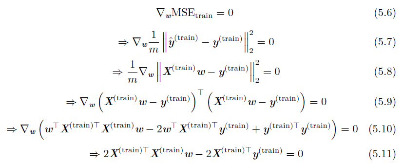
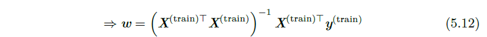
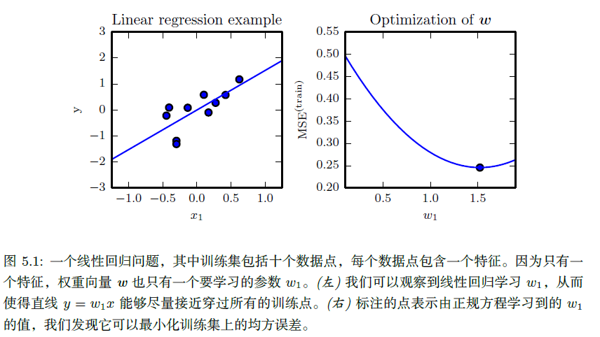
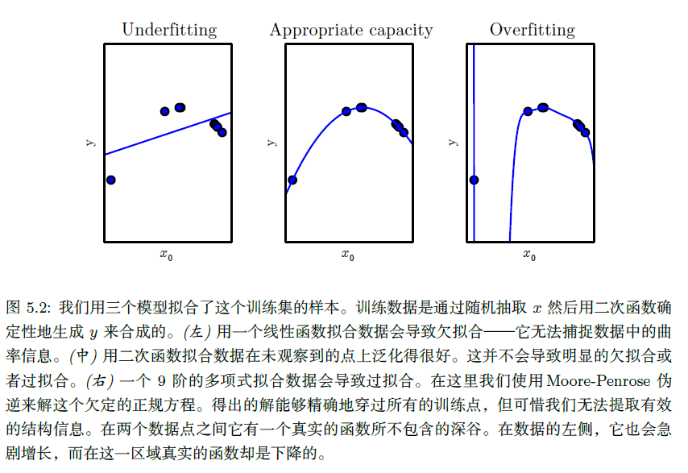
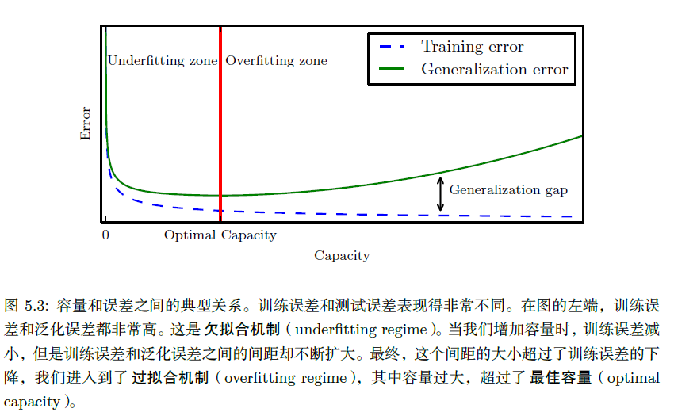
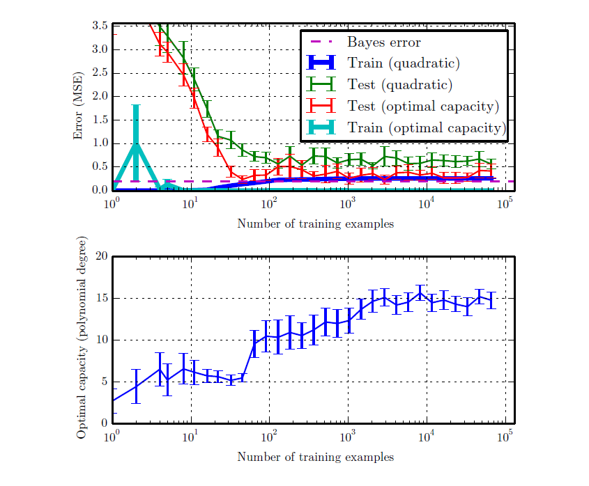
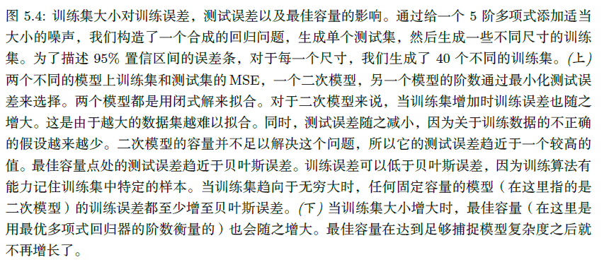
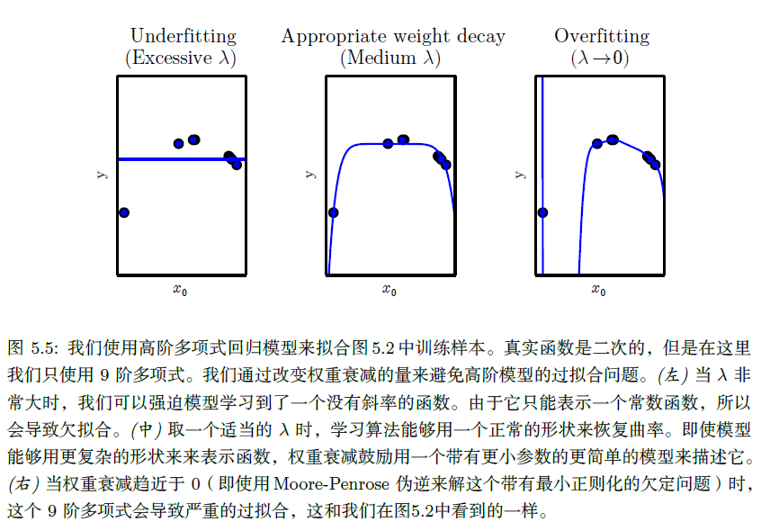
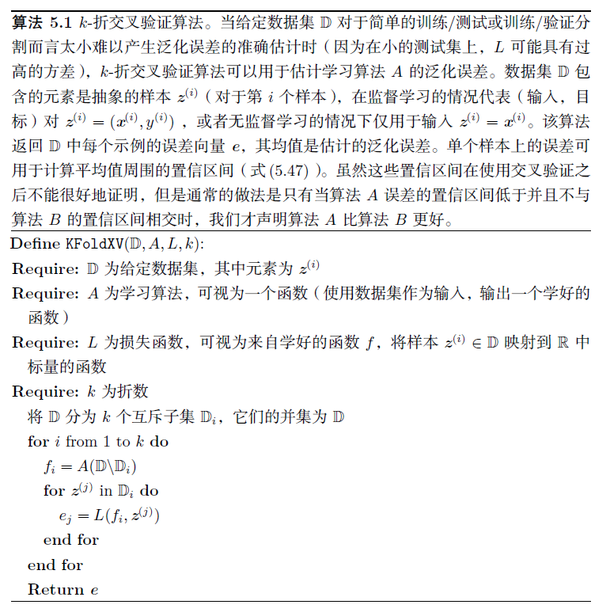

## 第5章 机器学习基础

### 5.1 学习算法

对于某类任务T 和性能度量P，一个计算机程序被认为可以从经验E 中学习是指，通过经验E 改进后，它在任务T 上由性能度量P 衡量的性能有所提升。——Mitchell(1997)对学习的定义

#### 5.1.1 任务T

从‘‘任务’’ 的相对正式的定义上说，学习过程本身不能算是任务。学习是我们所谓的获取完成任务的能力。例如，我们的目标是使机器人能够行走，那么行走便是任务。我们可以编程让机器人学会如何行走，或者可以人工编写特定的指令来指导机器人如何行走。

通常机器学习任务定义为机器学习系统应该如何处理样本（example）。样本是指我们从某些希望机器学习系统处理的对象或事件中收集到的已经量化的特征（feature）的集合。我们通常会将样本表示成一个向量x∈R^n，其中向量的每一个元素xi 是一个特征。例如，一张图片的特征通常是指这张图片的像素值。

一些非常常见的机器学习任务列举如下：

- **分类**。计算机程序需要制定某些输入属于k类中的哪一类。分类任务中有一个任务是对象识别，其中输入是图片（通常由一组像素亮度值表示），输出是表示图片物体的数字码。例如，Willow Garage PR2 机器人能像服务员一样识别不同饮料，并送给点餐的顾客(Goodfellow et al., 2010)。目前，最好的对象识别工作正是基于深度学习的(Krizhevsky et al., 2012a; Ioffe and Szegedy,2015)。
- **输入缺失分类**。当输入向量的每个度量不被保证的时候，即输入向量的元素可能丢失，分类问题将会变得更有挑战性。当一些输入可能丢失时，学习算法必须学习一组函数，而不是单个分类函数。每个函数对应着分类具有不同缺失输入子集的x。这种情况在医疗诊断中经常出现，因为很多类型的医学测试是昂贵的，对身体有害的。有效地定义这样一个大集合函数的方法是学习所有相关变量的概率分布，然后通过边缘化缺失变量来解决分类任务。使用n 个输入变量，我们现在可以获得每个可能的缺失输入集合所需的所有2^n 个不同的分类函数，但是计算机程序仅需要学习一个描述联合概率分布的函数。参见Goodfellow et al. (2013d) 了解以这种方式将深度概率模型应用于这类任务的示例。
- **回归**。计算机程序需要对给定输入预测数值。例如预测投保人的索赔金额（用于设置保险费），或者预测证券未来的价格。
- **转录**。机器学习系统观测一些相对非结构化表示的数据，并转录信息为离散的文本形式。例如，光学字符识别要求计算机程序根据文本图片返回文字序列（ASCII 码或者Unicode 码）。谷歌街景以这种方式使用深度学习处理街道编号(Goodfellow et al., 2014d)。
- **机器翻译**。输入是一种语言的符号序列，计算机程序必须将其转化成另一种语言的符号序列。
- **结构化输出**。结构化输出任务的输出是向量或者其他包含多个值的数据结构，并且构成输出的这些不同元素间具有重要关系。这是一个很大的范畴，包括上述转录任务和翻译任务在内的很多其他任务。例如语法分析——映射自然语言句子到语法结构树，并标记树的节点为动词、名词、副词等等。参考Collobert(2011) 将深度学习应用到语法分析的示例。另一个例子是图像的像素级分割，将每一个像素分配到特定类别。例如，深度学习可用于标注航拍照片中的道路位置(Mnih and Hinton, 2010)。在这些标注型的任务中，输出的结构形式不需要和输入尽可能相似。例如，在为图片添加描述的任务中，计算机程序观察到一幅图，输出描述这幅图的自然语言句子(Kiros et al., 2014a,b; Mao et al.,2014; Vinyals et al., 2015b; Donahue et al., 2014; Karpathy and Li, 2015; Fang et al., 2015; Xu et al., 2015)。这类任务被称为结构化输出任务是因为输出值之间内部紧密相关。例如，为图片添加标题的程序输出的单词必须组合成一个通顺的句子。
- **异常检测**。计算机程序在一组事件或对象中筛选，并标记不正常或非典型的个体。比如信用卡欺诈检测。通过对你的购买习惯建模，信用卡公司可以检测到你的卡是否被滥用。如果窃贼窃取你的信用卡或信用卡信息，窃贼采购物品的分布通常和你的不同。参考Chandola et al. (2009) 了解欺诈检测方法。
- **合成和采样**。机器学习程序生成一些和训练数据相似的新样本。例如，视频游戏可以自动生成大型物体或风景的纹理，而不是让艺术家手动标记每个像素(Luo et al., 2013)。在某些情况下，我们希望采样或合成过程可以根据给定的输入生成一些特定类型的输出。例如，在语音合成任务中，我们提供书写的句子，要求程序输出这个句子语音的音频波形。这是一类结构化输出任务，但是多了每个输入并非只有一个正确输出的条件，并且我们明确希望输出有很多变化，这可以使结果看上去更加自然和真
  实。
- **缺失值填补**。算法必须填补给定输入中的缺失值。
- **去噪**。算法可以根据损坏后的样本预测干净的样本，或者更一般地预测条件概率分布。
- **密度估计或概率质量函数估计**。算法学习样本采样空间的概率密度函数或者概率质量函数。

注意，这里列举的任务类型只是用来介绍机器学习可以做哪些任务，并非严格地定义机器学习任务分类。

#### 5.1.2 性能度量P

为了评估机器学习算法的能力，我们必须设计其性能的定量度量。通常性能度量P 是特定于系统执行的任务T 而言的。

对于诸如分类、缺失输入分类和转录任务，我们通常度量模型的准确率（accuracy）。准确率是指该模型输出正确结果的样本比率。我们也可以通过错误率（error rate）得到相同的信息。错误率是指该模型输出错误结果的样本比率。我们通常把错误率称为0 - 1损失的期望。在一个特定的样本上，如果结果是对的，那么0 - 1损失是0；否则是1。

但是对于密度估计这类任务而言，度量准确率，错误率或者其他类型的0 - 1损失是没有意义的。反之，我们必须使用不同的性能度量，使模型对每个样本都输出一个连续数值的得分。最常用的方法是输出模型在一些样本上概率对数的平均值。

通常，我们会更加关注机器学习算法在未观测数据上的性能如何，因为这将决定其在实际应用中的性能。因此，我们使用**测试集**（test set）数据来评估系统性能，将其与训练机器学习系统的训练集数据分开。

#### 5.1.3 经验E

根据学习过程中的不同经验，机器学习算法可以大致分类为**无监督**（unsupervised）算法和**监督**（supervised）算法。

本书中的大部分学习算法可以被理解为在整个**数据集**（dataset）上获取经验。数据集是指很多样本组成的集合。有时我们也将样本称为**数据点**（data point）。

无监督学习算法（unsupervised learning algorithm）训练含有很多特征的数据集，然后学习出这个数据集上有用的结构性质。在深度学习中，我们通常要学习生成数据集的整个概率分布，显式地，比如密度估计，或是隐式地，比如合成或去噪。还有一些其他类型的无监督学习任务，例如聚类，将数据集分成相似样本的集合。

监督学习算法（supervised learning algorithm）训练含有很多特征的数据集，不过数据集中的样本都有一个标签（label）或目标（target）。例如，Iris 数据集注明了每个鸢尾花卉样本属于什么品种。监督学习算法通过研究Iris 数据集，学习如何根据测量结果将样本划分为三个不同品种。

术语监督学习（supervised learning）源自这样一个视角，教员或者老师提供目标y 给机器学习系统，指导其应该做什么。在无监督学习中，没有教员或者老师，算法必须学会在没有指导的情况下理解数据。

无监督学习和监督学习不是严格定义的术语。它们之间界线通常是模糊的。很多机器学习技术可以用于这两个任务。例如，概率的链式法则表明对于向量x ∈ R^n，联合分布可以分解成

$$P(\text x) = \prod_{i=1}^{n} P(\text{x}_i \hspace{.1cm} | \hspace{.1cm} \text{x}_1,..., \text{x}_{i-1}) $$

该分解意味着我们可以将其拆分成n 个监督学习问题，来解决表面上的无监督学习p(x)。另外，我们求解监督学习问题p(y | x) 时，也可以使用传统的无监督学习策略学习联合分布p(x, y)，然后推断

$p(y|x)=\frac {p(x,y)}{\sum_{y'}p(x,y')}$

学习范式的其他变种也是有可能的。例如，半监督学习中，一些样本有监督目标，但其他样本没有。在多实例学习中，样本的整个集合被标记为含有或者不含有该类的样本，但是集合中单独的样本是没有标记的。

有些机器学习算法并不是训练于一个固定的数据集上。例如， **强化学习**（reinforcement learning）算法会和环境进行交互，所以学习系统和它的训练过程会有反馈回路。

表示数据集的常用方法是**设计矩阵**（design matrix）。设计矩阵的每一行包含
一个不同的样本。每一列对应不同的特征。

#### 5.1.4 示例：线性回归

线性回归解决回归问题，我们的目标是建立一个系统，将向量x作为输入，预测标量y作为输出。。线性回归的输出是其输入的线性函数。令$\hat y$ 表示模型预测y 应该取的值。我们定义输出为

$ \hat y = w^Tx$

其中w是**参数**（parameter）向量。我们可以将w 看作是一组决定每个特征如何影响预测的权重（weight）。

那么我们可以定义任务T：通过输出$ \hat y = w^Tx$ 从x预测y。还需要定义性能度量P。

度量模型性能的一种方法是计算模型在测试集上的均方误差（mean squared error）。

$MSE_{test}=\frac 1 m \sum_i (\hat y^{(test)}-y^{(test)})_i^2=\frac 1 m ||\hat y^{(test)}-y^{(test)}||_2^2$

为了构建一个机器学习算法， 我们需要设计一个算法， 通过观察训练集(X^(train), y^(train)) 获得经验，减少MSE_test 以改进权重w。一种直观方式(5.5.1节会说明其合法性)是最小化训练集上的均方误差，即MSE_train。

最小化MSE_train，我们可以简单地求解其导数为0 的情况：

通过式(5.12)给出解的系统方程被称为**正规方程**(normal equation)。计算式(5.12) 构成了一个简单的机器学习算法。下图展示了线性回归算法的使用示例。

术语**线性回归**（linear regression）通常用来指稍微复杂一些，附加额外参数（截距项b）的模型。在这个模型中，

$ \hat y = w^Tx+b$

因此从参数到预测的映射仍是一个线性函数，而从特征到预测的映射是一个仿射函数。如此扩展到仿射函数意味着模型预测的曲线仍然看起来像是一条直线，只是这条直线没必要经过原点。

截距项b 通常被称为仿射变换的**偏置**（bias）参数。

### 5.2 容量、过拟合和欠拟合

机器学习的主要挑战是我们的算法必须能够在先前未观测的新输入上表现良好，而不只是在训练集上表现良好。在先前未观测到的输入上表现良好的能力被称为**泛化**（generalization）。

通常情况下，当我们训练机器学习模型时，我们可以使用某个训练集，在训练集上计算一些被称为**训练误差**（training error）的度量误差，目标是降低训练误差。目前为止，我们讨论的是一个简单的优化问题。机器学习和优化不同的地方在于，我们也希望**泛化误差**（generalization error）（也被称为测试误差（test error））很低。泛化误差被定义为新输入的误差期望。

通常，我们度量模型在训练集中分出来的测试集（test set）样本上的性能，来评估机器学习模型的泛化误差。

训练集和测试集数据通过数据集上被称为**数据生成过程**（data generating process）的概率分布生成。通常，我们会做一系列被统称为**独立同分布假设**（i.i.d. assumption）的假设。该假设是说，每个数据集中的样本都是彼此**相互独立的**（independent），并且训练集和测试集是**同分布的**（identically distributed），采样自相同的分布。这个假设使我们能够在单个样本的概率分布描述数据生成过程。然后相同的分布可以用来生成每一个训练样本和每一个测试样本。我们将这个共享的潜在分布称为**数据生成分布**（data generating distribution），记作p_data。这个概率框架和独立同分布假设允许我们从数学上研究训练误差和测试误差之间的关系。

我们能观察到训练误差和测试误差之间的直接联系是，随机模型训练误差的期望和该模型测试误差的期望是一样的。这是因为这两个期望的计算都使用了相同的数据集生成过程。

当然，当我们使用机器学习算法时，我们不会提前固定参数，然后采样得到两个数据集。我们采样得到训练集，然后挑选参数去降低训练集误差，然后采样得到测试集。在这个过程中，测试误差期望会大于或等于训练误差期望。以下是决定机器学习算法效果是否好的因素：

1. 降低训练误差。
2. 缩小训练误差和测试误差的差距。

这两个因素对应机器学习的两个主要挑战： **欠拟合**（underfitting）和**过拟合**（overfitting）。欠拟合是指模型不能在训练集上获得足够低的误差。而过拟合是指训练误差和和测试误差之间的差距太大。

通过调整模型的**容量**（capacity），我们可以控制模型是否偏向于过拟合或者欠拟合。通俗地，模型的容量是指其拟合各种函数的能力。容量低的模型可能很难拟合训练集。容量高的模型可能会过拟合，因为记住了不适用于测试集的训练集性质。

一种控制训练算法容量的方法是选择**假设空间**（hypothesis space），即学习算法可以选择为解决方案的函数集。例如，线性回归算法将关于其输入的所有线性函数作为假设空间。广义线性回归的假设空间包括多项式函数，而非仅有线性函数。这样做就增加了模型的容量。例如在线性回归模型中引入x^2， x^3等作为另外的特征。

当机器学习算法的容量适合于所执行任务的复杂度和所提供训练数据的数量时，算法效果通常会最佳。

下图展示了这个原理的使用情况。

综上，改变模型的容量的方法有：

- 改变输入特征的数目

- 加入这些特征对应的参数。

事实上，还有很多方法可以改变模型的容量。容量不仅取决于模型的选择。

模型规定了调整参数降低训练目标时，学习算法可以从哪些函数族中选择函数。这被称为模型的**表示容量**（representational capacity）。在很多情况下，从这些函数中挑选出最优函数是非常困难的优化问题。实际中，学习算法不会真的找到最优函数，而仅是找到一个可以大大降低训练误差的函数。额外的限制因素，比如优化算法的不完美，意味着学习算法的**有效容量**（effective capacity）可能小于模型族的表示容量。

提高机器学习模型泛化的现代思想可以追溯到早在托勒密时期的哲学家的思想。**奥卡姆剃刀**（Occam’s razor）（c. 1287-1387）原则指出，在同样能够解释已知观测现象的假设中，我们应该挑选‘‘最简单’’ 的那一个。

统计学习理论提供了量化模型容量的不同方法。在这些中，最有名的是**Vapnik-Chervonenkis 维度**（Vapnik-Chervonenkis dimension, VC）。VC维度量二元分类器的容量。VC维定义为该分类器能够分类的训练样本的最大数目。假设存在m 个不同x 点的训练集，分类器可以任意地标记该m 个不同的x 点，VC维被定义为m的最大可能值。

量化模型的容量使得统计学习理论可以进行量化预测。统计学习理论中最重要的结论阐述了训练误差和泛化误差之间差异的上界随着模型容量增长而增长，但随着训练样本增多而下降。

我们必须记住虽然更简单的函数更可能泛化（训练误差和测试误差的差距小），但我们仍然需要选择一个充分复杂的假设以达到低的训练误差。通常，当模型容量上升时，训练误差会下降，直到其渐近最小可能误差（假设误差度量有最小值）。通常，泛化误差是一个关于模型容量的U 形曲线函数。如图5.3 所示。

为考虑容量任意高的极端情况，我们介绍非参数（non-parametric）模型的概念。至此，我们只探讨过参数模型，例如线性回归。参数模型学习的函数在观测到新数据前，参数向量的分量个数是有限且固定的。非参数模型没有这些限制。

有时，非参数模型仅是一些不能实际实现的理论抽象（比如搜索所有可能概率分布的算法）。然而，我们也可以设计一些实用的非参数模型，使它们的复杂度和训练集大小有关。这种算法的一个示例是最近邻回归（nearest neighbor regression）。不像线性回归有固定长度的向量作为权重，最近邻回归模型存储了训练集中所有的X 和y。当需要为测试点x 分类时，模型会查询训练集中离该点最近的点，并返回相关的回归目标。

最后，我们也可以将参数学习算法嵌入另一个增加参数数目的算法来创建非参数学习算法。例如，我们可以想象这样一个算法，外层循环调整多项式的次数，内层循环通过线性回归学习模型。

理想模型假设我们能够预先知道生成数据的真实概率分布。然而这样的模型仍然会在很多问题上发生一些错误，因为分布中仍然会有一些噪声。在监督学习中，从x 到y 的映射可能内在是随机的，或者y 可能是其他变量（包括x 在内）的确定性函数。从预先知道的真实分布p(x, y) 预测而出现的误差被称为**贝叶斯误差**（Bayes error）。

训练误差和泛化误差会随训练集的大小发生变化。泛化误差的期望从不会因训练样本数目的增加而增加。对于非参数模型而言，更多的数据会得到更好的泛化能力，直到达到最佳可能的泛化误差。任何模型容量小于最优容量的固定参数模型会渐近到大于贝叶斯误差的误差值。如图5.4 所示。值得注意的是，具有最优容量的模型仍然有可能在训练误差和泛化误差之间存在很大的差距。在这种情况下，我们可以通过收集更多的训练样本来缩小差距。

#### 5.2.1 没有免费午餐定理

机器学习的**没有免费午餐定理**（no free lunch theorem）表明(Wolpert, 1996)，在所有可能的数据生成分布上平均之后，每一个分类算法在未事先观测的点上都有相同的错误率。换言之，在某种意义上，没有一个机器学习算法总是比其他的要好。我们能够设想的最先进的算法和简单地将所有点归为同一类的简单算法有着相同的平均性能（在所有可能的任务上）。

幸运的是，这些结论仅在我们考虑所有可能的数据生成分布时才成立。在真实世界应用中，如果我们对遇到的概率分布进行假设的话，那么我们可以设计在这些分布上效果良好的学习算法。

这意味着机器学习研究的目标不是找一个通用学习算法或是绝对最好的学习算法。反之，我们的目标是理解什么样的分布与人工智能获取经验的‘‘真实世界’’ 相关，什么样的学习算法在我们关注的数据生成分布上效果最好。

#### 5.2.2 正则化

没有免费午餐定理暗示我们必须在特定任务上设计性能良好的机器学习算法。我们建立一组学习算法的偏好来达到这个要求。当这些偏好和我们希望算法解决的学习问题相吻合时，性能会更好。
至此，我们具体讨论修改学习算法的方法只有，通过增加或减少学习算法可选假设空间的函数来增加或减少模型的表示容量。

算法的效果不仅很大程度上受影响于假设空间的函数数量，也取决于这些函数的具体形式。我们已经讨论的学习算法（线性回归）具有包含其输入的线性函数集的假设空间。对于输入和输出确实接近线性相关的问题，这些线性函数是很有用的。对于完全非线性的问题它们不太有效。例如，我们用线性回归，从x 预测sin(x)，效果不会好。因此我们可以通过两种方式控制算法的性能，一是允许使用的函数种类，二是这些函数的数量。

在假设空间中，相比于某一个学习算法，我们可能更偏好另一个学习算法。这意味着两个函数都是符合条件的，但是我们更偏好其中一个。只有非偏好函数比偏好函数在训练数据集上效果明显好很多时，我们才会考虑非偏好函数。

例如，我们可以加入**权重衰减**（weight decay）来修改线性回归的训练标准。带权重衰减的线性回归最小化训练集上的均方误差和正则项的和J(w)，其偏好于平方L2 范数较小的权重。具体如下：

$J(w)=MSE_{train}+\lambda w^Tw$

其中λ是提前挑选的值，控制我们偏好小范数权重的程度。最小化J(w) 可以看作是拟合训练数据和偏好小权重范数之间的权衡。这会使得解决方案的斜率较小，或是将权重放在较少的特征上。我们可以训练具有不同λ值的高次多项式回归模型，来举例说明如何通过权重衰减控制模型欠拟合或过拟合的趋势。如图5.5 所示。

更一般地，正则化一个学习函数f(x; θ) 的模型，我们可以给代价函数添加被称为正则化项（regularizer）的惩罚。

表示对函数的偏好是比增减假设空间的成员函数更一般的控制模型容量的方法。我们可以将去掉假设空间中的某个函数看作是对不赞成这个函数的无限偏好。

有很多其他方法隐式或显式地表示对不同解的偏好。总而言之，这些不同的方法都被称为**正则化**（regularization）。正则化是指我们修改学习算法，使其降低泛化误差而非训练误差。正则化是机器学习领域的中心问题之一，只有优化能够与其重要性相媲。

没有免费午餐定理已经清楚地阐述了没有最优的学习算法，特别地，没有最优的正则化形式。反之，我们必须挑选一个非常适合于我们所要解决的任务的正则形式。深度学习中普遍的（特别是本书中的）理念是大量任务（例如所有人类能做的智能任务）也许都可以使用非常通用的正则化形式来有效解决。

### 5.3 超参数和验证集

大多数机器学习算法都有超参数，可以设置来控制算法行为。超参数的值不是通过学习算法本身学习出来的。

在图5.2 所示的多项式回归示例中，有一个超参数：多项式的次数，作为**容量**超参数。控制权重衰减程度的λ是另一个超参数。

有时一个选项被设为学习算法不用学习的超参数，是因为它太难优化了。更多的情况是，该选项必须是超参数，因为它不适合在训练集上学习。这适用于控制模型容量的所有超参数。如果在训练集上学习超参数，这些超参数总是趋向于最大可能的模型容量，导致过拟合（参考图5.3 ）。例如，相比低次多项式和正的权重衰减设定，更高次的多项式和权重衰减参数设定λ= 0 总能在训练集上更好地拟合。

为了解决这个问题，我们需要一个训练算法观测不到的**验证集**（validation set）样本。

测试样本不能以任何形式参与到模型的选择中，包括设定超参数。基于这个原因，测试集中的样本不能用于验证集。因此，我们总是从训练数据中构建验证集。特别地，我们将训练数据分成两个不相交的子集。其中一个用于学习参数。另一个作为验证集，用于估计训练中或训练后的泛化误差，更新超参数。用于学习参数的数据子集通常仍被称为训练集，尽管这
会和整个训练过程用到的更大的数据集相混。用于挑选超参数的数据子集被称为验证集（validation set）。通常，80% 的训练数据用于训练，20% 用于验证。由于验证集是用来‘‘训练’’ 超参数的，尽管验证集的误差通常会比训练集误差小，验证集会低估泛化误差。所有超参数优化完成之后，泛化误差可能会通过测试集来估计。

#### 5.3.1 交叉验证

将数据集分成固定的训练集和固定的测试集后，若测试集的误差很小，这将是有问题的。一个小规模的测试集意味着平均测试误差估计的统计不确定性，使得很难判断算法A 是否比算法B 在给定的任务上做得更好。

当数据集有十万计或者更多的样本时，这不会是一个严重的问题。当数据集太小时，也有替代方法允许我们使用所有的样本估计平均测试误差，代价是增加了计算量。这些过程是基于在原始数据上随机采样或分离出的不同数据集上重复训练和测试的想法。最常见的是k-折交叉验证过程，如算法5.1 所示，将数据集分成k 个不重合的子集。测试误差可以估计为k 次计算后的平均测试误差。在第i 次测试时，数据的第i 个子集用于测试集，其他的数据用于训练集。带来的一个问题是不存在平均误差方差的无偏估计(Bengio and Grandvalet, 2004)，但是我们通常会使用近似来解决。

### 5.4 估计、偏差和方差

#### 5.4.1 点估计

#### 5.4.2 偏差

#### 5.4.3 方差和标准差

#### 5.4.4 权衡偏差和方差以最小化均方误差

#### 5.4.5 一致性

### 5.5 最大似然估计

#### 5.5.1 条件对数似然和均方误差

#### 5.5.2 最大似然的性质

### 5.6 贝叶斯估计

#### 5.6.1 最大后验(MAP)估计

### 5.7 监督学习算法

#### 5.7.1 概率监督学习

#### 5.7.2 支持向量机

#### 5.7.3 其他简单的监督学习算法

### 5.8 无监督学习算法

#### 5.8.1 主成分分析

#### 5.8.2 k-均值聚类

### 5.9 随机梯度下降

### 5.10 构建机器学习算法

### 5.11 促使深度学习发展的挑战

#### 5.11.1 维数灾难

#### 5.11.2 局部不变性和平滑正则化

#### 5.11.3 流形学习

