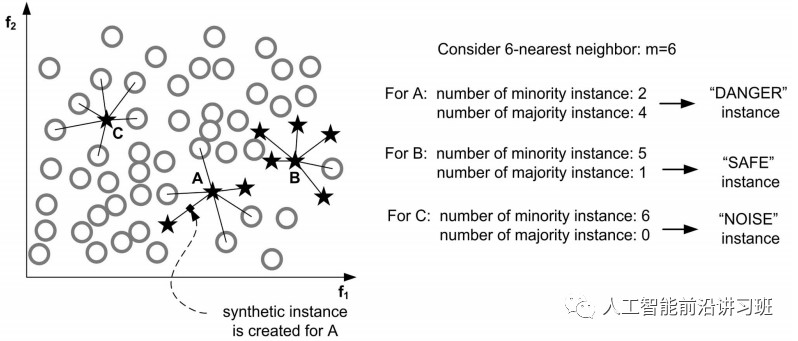
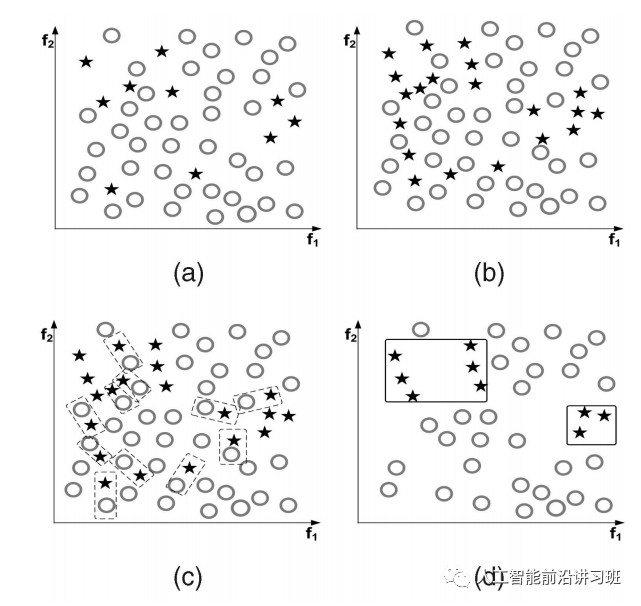

## 数据不平衡

### **数据层面策略：采样技术** 

**随机欠采样和随机过采样**

随机欠采样是针对数据较多的类别下手。通过随机从样本较多的数据类中采样得到一个较小的子集，将此子集和数据较少的类结合作为新的数据集。 

欠采样的优缺点都很明显。优点是在平衡数据的同时减小了数据量，加速训练，尤其是当样本集规模很大的时候。但是这也正是造成其缺点的主要原因，数据减少会影响模型的特征学习能力和泛化能力。

与欠采样相反的是，过采样通过随机复制样本较少类别中的样本以期达到减少不平衡的目的。

过采样的优缺点也很明显。优点是相对于欠采样的方法，过采样没有导致数据信息损失，在实际操作中一般效果也好于欠采样。但是由于对较少类别的复制，过采样增加了过拟合的可能性。 

**基于聚类的过采样** 

这种方法先对不同的类别分别进行聚类，一般情况下设置样本较多的类聚类中心数目较多，而样本较少的类聚类中心较少。然后通过对每个cluster进行过采样/欠采样使原始类别中所有的cluster有相同数目的样本。 

这种方法通过聚类作为中介不但一定程度上缓解了类间的样本不平衡问题，还一定程度上缓解了类内的不平衡问题。但是这种方法和一般的过采样方法一样容易使模型对训练数据过拟合。 

**Informed Over Sampling (SMOTE)** 

由于在一般的过采样方法中直接复制少数类别中的样本容易造成模型泛化能力下降，所以就提出了这种利用人造数据的方法减弱过采样带来的过拟合的方法。这种方法先对数据较少的类别抽取一个子集，然后对这个子集进行过采样。但是这时的过采样不再是直接复制，而是利用人为的方法生成相似的样本。

SMOTE的人为生成方式很简单，如下图b中的一个样本xi，先找到其近邻的K个样本，然后从这几个近邻样本中随机选取一个xi^hat，利用以下公式即可得到新的人工生成样本：

$x_{new}=x_i +(\hat x_i -x_i)\times \delta$

如果是下图所示的二维情况，可以看成是在两者连线中间选择了一个点作为人工样本。 

这种方法的优点是通过人造相似样本取代直接复制的方法减弱了过拟合，也没有丢失有用的信息。但是这种方法在进行人工合成样本时没有考虑进去近邻样本可能来自于不同类别，导致增大类别间的重叠。另外SMOTE在数据维度很高时效率很低。 

**Borderline-SMOTE** 

SMOTE没有考虑样本较少的那个类别（minority classes）自身潜在的分布，Borderline-SMOTE在此上面进行了优化。

MSMOTE通过计算minority classes最近邻K个样本中属于原始类别(minority和majority)的比例将minority classes分为三个不同的组：Danger，Safe，Noise。如下图中A属于Noise，B属于Safe，C属于Danger。

然后只对Danger中的样本采用SMOTE算法，其他两类不再过采样。

除了Borderline-SMOTE外，还有ADASAN等自适应人工合成样本的方式

**基于数据清洗的SMOTE** 

正如前文所示，实际的数据中不但存在样本不均衡的问题，还经常伴随着不同类别的样本重叠问题，如下图a所示。如果直接进行SMOTE过采样，得到的结果如b所示，虽然minority classes样本数目增多了，但是样本的重叠反而加剧了，很明显这并不有利于分类。

如果此时有一种数据清洗技术可以去掉一些重叠样本，那么对分类来说将会十分有益。这就是将要讲述的Tomek Links方法。对于一对样本(x_i, x_j)其中x_i来自于minority classes，x_j来自于majority classes。如果不存在一个x_k使得：

$d(x_i,x_k) < d(x_i, x_j) 或者d(x_j, x_k) < d(x_i, x_j)$

那么称(x_i, x_j)是一个TomekLink。如下图c中的虚线矩形框中的样本对。当得到TomekLink之后，移去所有的Tomek Link并且反复进行。得到结果如d所示。此时样本的重叠大大减小。Tomek Link的优势在于可以和很多算法结合起来，如CNN+Tomek Link。 

### **算法策略： 集成算法** 

集成策略通常通过将多个分类器结果进行融合来提高算法效果。 

**Bagging** 

Bagging是Bootstrap Aggregating的缩写。传统的Bagging算法先生成n个不同的bootstrap训练样本集，然后将算法分别在每个样本集上进行训练，最后将所有的预测结果进行融合。Bagging在一定程度上可以减弱过拟合。和Boosting不同的是，Bagging是允许有放回的数据重采样。 

Bagging的优点是可以提高算法的稳定性和准确率，减弱算法的variance和过拟合，而且在噪声样本环境下，Bagging通常比Boosting表现要好。但是Baging的问题是只在基础分类器都能产生想对不错的结果的时候work，如果有的基础分类器结果很差，可能会很严重的影响Bagging的结果。 

**Boosting**

Boosting通过将弱分类器结合起来构成强分类器。在新一轮的迭代中，新的分类器更加关注上一轮训练中分类错误的样本，给这些样本赋予更大的权重。Ada Boost是Boosting算法中的一个代表。

注意在Boosting算法中所谓的弱分类器的基本假设是其要率好于随机选择的结果，这样才能保证集成之后能提供一个更好的效果。

Boosting算法实现起来很容易并且有很好的泛化性，但是其缺点是对于噪音和离群点比较敏感。

在深度学习流行之前，XG Boost一度占据了Kaggle冠军的大半壁江山。即使现在深度学习如此火热，XG Boost仍然没有落伍，Kaggle比赛仍有很多将其与深度学习结合取得冠军的例子。XG Boost由于其并行执行的特性使其10倍速度于其他的Boosting技术。并且其可以很容易的使用各种自定义的优化器和评价标准，而且其在处理missing value方面表现非常好。

在面对不均衡数据时，没有一步到位的算法可以解决，可能需要尝试多种策略寻找最适应数据集的算法。在大多数情况下，数据合成方法中的SMOTE及其衍生品效果优于其他数据平衡方法。经常的做法是将SMOTE等数据合成方法与Bagging和Boosting等算法结合起来一起使用。

不平衡数据处理算法的研究现在依然不少，只是多数情况下会与具体研究的方向结合起来。如2017年的focal loss在目标检测领域大获成功，其简洁又有效的思路让人眼前一亮。

其它资料：

《8 Tactics to Combat Imbalanced Classes in Your Machine LearningDataset》

来源：https://mp.weixin.qq.com/s/Mc8yYkDTj7I2KYGALceHfw

