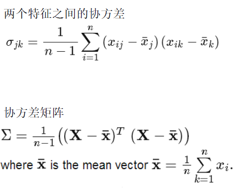

特征工程 Feature Engineering

# 特征工程简介

## 特征工程


## 特征类型

- 标称特征Nominal/Categorical feature
- 二值特征Binary feature
- 序数特征Ordinal feature
- 数值特征Numeric feature

离散特征， 连续特征

## 独热编码One-hot encoding

| is_red | is_green | is_blue |
| ------ | :------: | ------: |
| 1      |    0     |       0 |
| 0      |    1     |       0 |
| 0      |    0     |       1 |

哑变量编码 dummy encoding

| is_red | is_green |
| ------ | :------: |
| 1      |    0     |
| 0      |    1     |
| 0      |    0     |

# 特征预处理

- 特征标准化 Standardization
- 特征归一化、正规化 Normalization
- 特征平滑，如log平滑

# 维度约简

==请解释什么是降维，在哪些地方会用到位置，以及它的好处是什么？==

降维是通过获得一组重要特征的主要变量来减少特征变量数量的过程。特征的重要性取决于特征变量对数据信息的贡献程度，以及你所使用的技术。而决定使用哪种技术取决于反复的试验和个人偏好。通常是从线性技术开始，然后转向非线性技术。数据集降维的好处是：（1）减少所需的存储空间（2）加速计算（例如在机器学习算法中），更少的维度意味着更少的计算，更少的维度允许使用不适用于高维度的算法（3）删除冗余特征，例如以平方米和平方英里存储地形大小没有任何意义（可能数据收集存在缺陷）（4）将数据维度减少到 2D 或 3D，这样我们就可以绘制和可视化它们，从而获得更多见解（5）太多的特征或太复杂的模型可能导致过拟合。

## 维度灾难

- 特征个数越多，分析特征、训练模型所需的时间就越长。
- 特征个数越多，模型也会越复杂，其推广能力会下降。

在高维情形下容易出现数据样本稀疏、距离计算困难等问题，这些对于大部分的机器学习方法而言都是严重障碍。这种现象称为“维度灾难curse of dimensionality”


缓解维度灾难的重要途径

特征抽取feature extraction
通过某种数学变换将原始高维属性空间转变为一个低维“子空间subspace”

特征选择feature selection
从给定的特征集合中选取出相关特征子集


## 特征选择

定义：

特征选择( Feature Selection )也称特征子集选择( Feature Subset Selection , FSS ) ，或属性选择( Attribute Selection ) ，是指从全部特征中选取一个特征子集，使构造出来的模型更好。

目的：

解决维度灾难问题
选取出真正相关的特征简化了模型，使研究人员易于理解数据产生的过程。

###==文本中常见的六种特征选择方法==：

1）DF(Document Frequency) 文档频率

DF:统计特征词出现的文档数量，用来衡量某个特征词的重要性

2）MI(Mutual Information) 互信息法

互信息法用于衡量特征词与文档类别直接的信息量。

如果某个特征词的频率很低，那么互信息得分就会很大，因此互信息法倾向"低频"的特征词。

相对的词频很高的词，得分就会变低，如果这词携带了很高的信息量，互信息法就会变得低效。

3）(Information Gain) 信息增益法

通过某个特征词的缺失与存在的两种情况下，语料中前后信息的增加，衡量某个特征词的重要性。

4）CHI(Chi-square) 卡方检验法

利用了统计学中的"假设检验"的基本思想：首先假设特征词与类别直接是不相关的

如果利用CHI分布计算出的检验值偏离阈值越大，那么更有信心否定原假设，接受原假设的备则假设：特征词与类别有着很高的关联度。

5）WLLR(Weighted Log Likelihood Ration)加权对数似然

6）WFO（Weighted Frequency and Odds）加权频率和可能性

http://blog.csdn.net/ztf312/article/details/50890099

### 子集搜索和子集评价

首先从特征全集中产生出一个特征子集，然后用评价函数对该特征子集进行评价，评价的结果与停止准则进行比较，若评价结果比停止准则好就停止，否则就继续产生下一组特征子集，继续进行特征选择。选出来的特征子集一般还要验证其有效性

### 特征选择类型

#### 过滤式 filter

先对数据集进行特征选择，然后再训练学习器，特征选择过程和后续学习方法无关。
这相当于先用特征选择过程对初始特征进行“过滤”，再用过滤后的特征来训练模型。


**单变量评价+ Threshold Filter/Select K Best**

- Information Gain (IG)  信息增益
- $\chi^2$ statistic (CHI)  卡方统计量
- Mutual Information (MI)  互信息，度量两个变量的相似性

特征子集的重要性是由子集中每个特征所对应的相关统计量分量之和来决定。

指定一个阈值τ，然后选择比τ大的相关统计量分量所对应的特征即可；

也可指定欲选取的特征个数k，然后选择相关统计量分量最大的k个特征。

For regression: **f_regression, mutual_info_regression**

For classisification: **chi2, f_classif, mutual_info_classif**

**SelectKBest** removes all but the k highest scoring features

**SelectPercenttile** removes all but a user-specified highest scoring percentage of features.

```python
from sklearn.datasets import load_iris
from sklearn.feature_selection import SelectKBest
from sklearn.feature_selection import chi2
iris = load_iris()
X, y = iris.data, iris.target
print(X.shape)  # (150,4)
X_new = SelectKBest(chi2, k=2).fit_transform(X,y)
print(X_new.shape)  # (150,2)
```

可以先过滤，再用更高级的方法进行特征选择

#### 包裹式 wrapper

包裹式特征选择直接把最终将要使用的学习器的性能作为特征子集的评价准则。
换言之，包裹式特征选择的目的就是为给定学习器选择最有利于其性能，“量身订做”的特征子集。


**学习器评价+ 启发式搜索**

子集评价：分类器错误率(Classifier error rate )
使用特定的分类器，用给定的特征子集对样本集进行分类，用分类的精度来衡量特征子集的好坏。
子集搜索：假如有p个特征，那么就会有2p种特征组合，每种组合对应了一个模型。由于每种特征组合都需要训练一次模型，而训练模型的代价实际上是很大的，无法枚举所有的特征子集来选最优的特征子集。简单的想法是利用启发式搜索方法：forward search（前向搜索）和backward search（后向搜索）。

序列前向选择( SFS , Sequential Forward Selection )

算法描述：特征子集X从空集开始，每次选择一个特征x加入特征子集X，使得特征函数J( X)最优。

算法评价：贪心算法，容易陷入局部最优值。缺点是只能加入特征而不能去除特征。


#### 包裹式 vs 过滤式

一般而言，由于包裹式特征选择方法直接针对给定学习器进行优化，因此从最终**学习器性能**来看，包裹式特征选择比过滤式特征选择**更好**，但另一方面，由于在特征选择过程中需多次训练学习器，因此包裹式特征选择的**计算开销**通常比过滤式特征选择**大得多**。

#### 嵌入式特征选择

嵌入式特征选择是将特征选择过程与学习器训练过程融为一体，两者在同一个优化过程中完成，即在学习器训练过程中自动地进行了特征选择。最典型的例子就是带剪枝的决策树和带L1范数的LASSO算法等。


###==分支定界法==

**在()情况下,用分支定界法做特征选择计算量相对较少?**

选用的可分性判据J具有可加性
选用的可分性判据J对特征数目单调不减
样本较多

C(n,d)>>n（n为原特征个数，d为要选出的特征个数）

BD,该算法的主要思路是：定义一个满足单调性条件的评价准则函数，对两个特征子集S1和S2而言,如果S1是S2的子集, 那么S1所对应的评价函数值必须要小于S2所对应的评价函数值,在定义了该评价函数的前提下,该算法对最终特征子集的选择过程可以用一棵树来描述,树根是所有特征的集合从树根可分性判据值和事先定义的最佳特征子集的特征数目,搜索满足要求的特征子集

但存在3个问题：

1于该算法无法对所有的特征依据其重要性进行排序!如何事先确定最优特征子集中特征的数目是一个很大的问题2合乎问题要求的满足单调性的可分性判据难以设计3当处理高维度多分类问题时!算法要运行多次!计算效率低下的问题将非常明显

## 特征抽取

**下列哪些方法可以用来对高维数据进行降维:**

```
LASSO
主成分分析法
聚类分析
小波分析法
线性判别法
拉普拉斯特征映射
```

都可以，lasso通过参数缩减达到降维的目的；

线性鉴别法即LDA通过找到一个空间使得类内距离最小类间距离最大所以可以看做是降维；

小波分析有一些变换的操作降低其他干扰可以看做是降维

拉普拉斯请看这个http://f.dataguru.cn/thread-287243-1-1.html

###主成分分析PCA

非监督算法，不考虑预测任务

==奇异值分解总是存在，但不一定唯一==

==在信号处理中认为信号具有较大的方差，噪声有较小的方差，信噪比就是信号与噪声的方差比，越大越好。==

PCA(principal Component Analysis)，即主成分分析方法，是一种使用最广泛的数据压缩算法。在PCA中，数据从原来的坐标系转换到新的坐标系，由数据本身决定。转换坐标系时，以方差最大的方向作为坐标轴方向，因为数据的最大方差给出了数据的最重要的信息。第一个新坐标轴选择的是原始数据中方差最大的方法，第二个新坐标轴选择的是与第一个新坐标轴正交且方差次大的方向（从直观上说，让两个字段尽可能表示更多的原始信息，我们是不希望它们之间存在（线性）相关性的，因为相关性意味着两个字段不是完全独立，必然存在重复表示的信息。）。重复该过程，重复次数为原始数据的特征维数。

通过这种方式获得的新的坐标系，我们发现，大部分方差都包含在前面几个坐标轴中，后面的坐标轴所含的方差几乎为0,。于是，我们可以忽略余下的坐标轴，只保留前面的几个含有绝不部分方差的坐标轴。事实上，这样也就相当于只保留包含绝大部分方差的维度特征，而忽略包含方差几乎为0的特征维度，也就实现了对数据特征的降维处理。

那么，我们如何得到这些包含最大差异性的主成分方向呢？事实上，通过计算数据矩阵的协方差矩阵，然后得到协方差矩阵的特征值及特征向量，选择特征值最大（也即包含方差最大）的N个特征所对应的特征向量组成的矩阵，我们就可以将数据矩阵转换到新的空间当中，实现数据特征的降维（N维）。

去除平均值
计算协方差矩阵（协方差矩阵表明了特征之间的相关性程度）
计算协方差矩阵的特征值和特征向量
将特征值排序
保留前N个最大的特征值对应的特征向量
将数据转换到上面得到的N个特征向量构建的新空间中（实现了特征压缩）

选择top最大的几个特征值对应的特征向量组合起来作为中间矩阵A(m×r)。原始数据标准化后的矩阵X(n×m)和A(m×r)相乘就得到主成分矩阵。（特征从m维压缩到r维)




X矩阵均值为0，所以Sx就是协方差矩阵。

$Z=W^TX$，Z为X对W做基变换后的数据，设Z的协方差矩阵为Sz，上述过程推导了Sx和Sz之间的关系。

PCA就是试图：

将一组N维向量降为K维（K大于0，小于N），其目标是选择K个单位正交基，使得原始数据变换到这组基上后，各字段两两间协方差为0，而字段的方差则尽可能大。

想让原始数据集X =>pca成数据集Z，使得Z的协方差矩阵是个对角矩阵。 
有上述推导可得，若有矩阵W能使X的协方差矩阵对角化，则W就是我们要找的PCA变换。

优化目标变成了寻找一个矩阵W，满足$W^TS_xW$是一个对角矩阵，并且对角元素按从大到小依次排列，那么W的前K行就是要寻找的基，用W的前K行组成的矩阵乘以X就使得X从N维降到了K维并满足上述优化条件。

首先，原始数据矩阵X的协方差矩阵C是一个实对称矩阵，它有特殊的数学性质：

1. 实对称矩阵不同特征值对应的特征向量必然正交。
2. 设特征值λ重数为r，则必然存在r个线性无关的特征向量对应于λ，因此可以将这r个特征向量单位正交化。

一个n行n列的实对称矩阵一定可以找到n个单位正交特征向量，将其按列组成矩阵E，则对协方差矩阵Sx有：$E^TS_xE$=对角矩阵

在解释一下，特征值λ为什么要从大到小排列，为什么要选较大的λ？
  因为我们协方差矩阵的对角线元素是方差，我们想要找方差较大的特征维度，所以要选择较大的对角线元素。 
  而对角矩阵Λ虽然是Sx经过线性变化后的矩阵，但它在对角线上元素的大小关系没变，特征维度i对应的特征值λi越大，该维度上数据的方差越大。


总结一下PCA的算法步骤： 
 设有n条m维数据。

1. 将原始数据按列组成m行n列矩阵X
2. 将X的每一行(代表一个属性字段）进行零均值化
3. 求出协方差矩阵$C=\frac1mXX^T$
4. 求出协方差矩阵的特征值及对应的特征向量
5. 将特征向量按对应特征值大小从上到下按行排列成矩阵，取前k行组成矩阵P
6. Y=PX即为降维到k维后的数据

###线性判别分析LDA

思想：同类样本的投影点尽可能接近、异类样本的投影点尽可能远离


同类样例的投影点尽可能接近---投影之后同类数据的方差尽可能小
异类样例的投影点尽可能远离---投影之后异类数据的中心点距离尽可能大

C类数据——> C-1维线性无关


PCA和LDA都是线性变换

### 多维尺度变换/多维缩放 MDS

多维尺度变换/多维缩放multi-dimensional scaling (MDS)

希望在低维空间中，原始空间样本之间的距离得以保持。


假设m个样本在原始空间的距离矩阵为D $ \in R^{m×m} $

第$i$ 行$j$ 列的元素$dist_{ij}$ 为样本$x_i$ 到 $x_j$ 的距离

样本在$d'$ 维空间的表示$Z\in R^{d'×m}, d' \leq d$

任意两个样本在$d'$ 维空间中的欧式距离等于原始空间中的距离

### 流形学习

样本点从二维空间中的矩形区域采样后以S型嵌入到三维空间，形成了一个流形空间。这个流形空间在局部具有欧式空间的性质，能用欧式距离来进行距离计算。
流形学习：将其映射回低维空间中，揭示其本质

学习流形学习理论可从Isomap算法看起


# 特征工程利器-深度学习

 

